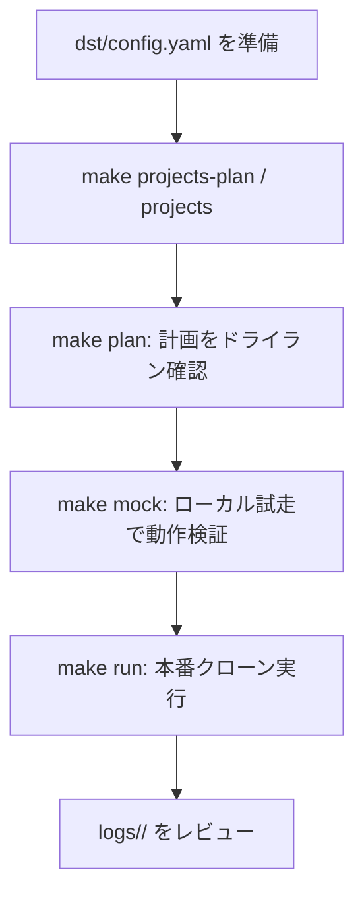

# GCP プロジェクト まるごとコピー ツール (Terraform / IaC ベース)

既存の GCP マルチプロジェクト環境（**Original / コピー元**）を、構成とデータを保持したまま
新しい GCP プロジェクト群（**Destination / コピー先**）へ **まるごとクローン** する運用自動化ツールです。

`dst/config.yaml` の定義に基づき、CAI スキャン → スナップショット検証 → Terraform エクスポート/適用 →
GCE 復元 → データ同期（GCS/BigQuery）までを一連で自動実行します。

> 🔐 **このツールは Original（ORG）プロジェクトに一切書き込みを行いません。**
> コード側で「src 操作は read-only のみ・借用 SA 必須・書き込み動詞は実行前に拒否」を強制しています。
> 詳細は後述の [ORG プロジェクト保護](#-org-プロジェクト保護) を参照してください。

---

## 前提条件と環境セットアップ

### 1. ツール要件
- **Python 3.12 以上**
- **`uv`**（Python パッケージ管理・仮想環境ツール）
  ```bash
  curl -sSf https://rye.astral.sh/get | bash   # または pipx install uv
  ```
- **`terraform`**（Step 4 のインフラ再現で使用）
- **`gcloud` / `bq`**（GCP CLI）
- **Config Connector**（**必須**）: Step 3 の Terraform エクスポート
  (`gcloud beta resource-config bulk-export --resource-format=terraform`) が依存する gcloud コンポーネント。
  未インストールだと `make plan` / `make run` は前提チェックで**即停止**します（Mock モードを除く）。
  ```bash
  gcloud components install config-connector   # インストール
  which config-connector                       # 確認（パスが返れば OK）
  ```
  > ℹ️ Config Connector は `bulk_export` ステップが有効な場合のみ必須です。`make mock` では実コマンドを叩かないためチェックをスキップします。

### 2. GCP 認証と安全なアクセス設定（Impersonation）
セキュリティ向上のため、サービスアカウントキー (JSON) は使用せず、
**サービスアカウントの権限借用 (Impersonation)** を使用します。

1. 実行ユーザーで gcloud にログイン
   ```bash
   gcloud auth login
   ```
2. 実行ユーザーに対し、移行用サービスアカウントへの
   「サービス アカウント トークン作成者 (`roles/iam.serviceAccountTokenCreator`)」ロールが
   付与されていることを確認してください。
3. **コピー元 (src) には読み取り専用 (Viewer 等)**、**コピー先 (dst) には編集権限 (Editor 等)** の
   SA を指定します（後述の `config.yaml`）。

> 🧰 **コピー元 (src) の借用 SA を一括セットアップ**
> `config.yaml` の `src_impersonate_service_account` に指定した読み取り専用 SA を、各 src プロジェクトに
> 作成・権限付与するヘルパースクリプトを用意しています。**この処理だけは ORG (src) への書き込みを伴う**ため、
> `sync_env.py` の ORG 保護とは意図的に分離した手動セットアップ用です（既定は dry-run）。
> ```bash
> scripts/bootstrap_src_sa.sh                          # dry-run（実行されるコマンドの表示のみ）
> scripts/bootstrap_src_sa.sh --apply                  # 実際に SA 作成・ロール付与
> scripts/bootstrap_src_sa.sh --apply --impersonator user:foo@example.com
> ```
> 付与内容（各 src プロジェクトごと）: `roles/viewer`（compute / GCS / BigQuery の read）、
> `roles/cloudasset.viewer`（CAI スキャン・bulk-export 用）、および実行アカウントへの
> `roles/iam.serviceAccountTokenCreator`（= SA 借用権限）。

### 3. 設定ファイル (config.yaml) の準備
テンプレートからコピーして、環境に合わせて編集します。

```bash
cp dst/config.yaml.template dst/config.yaml
```

`dst/config.yaml` で定義する主な項目:
- **`project_mapping`**: コピー元 (src) とコピー先 (dst) のプロジェクト ID、および借用 SA
  (`src_impersonate_service_account` / `dst_impersonate_service_account`)。`host_project` と `service_projects` を定義します。
- **`rename_rules`**: GCS バケット等のグローバルユニークなリソースのリネーム規則。
- **`steps`**: 各ステップ (1〜6) の有効/無効と個別設定（スナップショット期限など）。
- **`global`**: `dry_run` / `verbose_logging` / `parallel_jobs` / `log_dir` / `org_log_file` / `dst_log_file`。
- **`bootstrap`**: コピー先プロジェクトを新規作成する場合の組織 ID / フォルダ ID（任意） / 請求先アカウント。

---

## 🚀 使い方（Makefile）

| コマンド | 説明 |
| :--- | :--- |
| `make setup` | uv 仮想環境の同期・セットアップ |
| `make projects-plan` | コピー先プロジェクト作成の **ドライラン** |
| `make projects` | コピー先プロジェクトを実際に作成（請求紐付け + API 有効化） |
| `make plan` | 移行処理の **ドライラン**（実行計画の表示のみ。ORG 書き込みなし） |
| `make mock` | **Mock モード** でローカル試走（GCP 未接続でも動作） |
| `make run` | 移行処理の **本番実行**（dst への書き込みを伴う） |
| `make test` | 単体テスト (pytest) を実行 |

各コマンドには `ARGS="..."` で追加の引数を渡せます（例: `make plan ARGS="--config path/to/config.yaml"`）。

---

## 💡 推奨運用フロー



### Step 0: コピー先プロジェクトの準備
```bash
make projects-plan   # 何が作成されるか確認
make projects        # 実際に作成（org_id / billing_account が必要）
```

### Step 1: 実行計画のドライラン確認
本番実行の前に、必ずドライランで実行計画を確認します。
ORG への書き込みは発生しません（src 操作は read-only のみ）。
```bash
make plan
```

> 🔍 **ドライランで計画・検証される項目**
> 1. **CAI 現状確認** (`cai_scan`): コピー元の有効なリソース一覧を探索。
> 2. **GCE スナップショット検証** (`gce_snapshot`): 各 VM に期限内（既定 30 日）の有効なスナップショットがあるか確認。なければエラー。
> 3. **Terraform コード生成** (`bulk_export`): Original リソースを HCL としてエクスポートし、プロジェクト ID 置換・GCS バケットのリネーム・`boot_disk.source` 行の削除を実施。
> 4. **インフラ再現** (`terraform_apply`): `terraform plan -out=tfplan` を生成（本番時のみ apply）。
> 5. **VM データ復元** (`gce_restore`): スナップショットから復元したディスクの差し替え計画。
> 6. **データ移行** (`data_sync`): GCS バケット（リネーム後）・BigQuery（location 継承）の同期計画。

### Step 2: Mock モードでのローカル試走（任意）
実際の GCP 環境や有効な SA がなくても、`make run` 全体のフローをエラーなく試走できます。
```bash
make mock
```
- Mock モードでは外部コマンドを実行せず、ダミーデータで一連の流れをシミュレートします。
- **未対応コマンドは安全のため即停止 (fail-closed)** します。

### Step 3: 本番実行
ドライラン計画に問題がなければ本番実行します。
```bash
make run
```

> 🚀 **クローンのメカニズム**
> 1. コピー先ホストプロジェクトに、Terraform で VPC・サブネット・NAT・FW 等のインフラを再現。
> 2. Original の有効なスナップショット（期限内）から、コピー先にディスクを復元。
> 3. 復元したブートディスクを VM に差し替えて起動（OS 状態・データごと完全復元）。
> 4. `rename_rules` に基づき GCS バケット等を衝突回避してリネームし、データを同期。
> 5. BigQuery データセットは **src の location を継承** して作成（クロスリージョン失敗を回避）。

---

## 🔐 ORG プロジェクト保護

このツールは「コピー元 (ORG) には絶対に変更を加えない」ことを **運用ルールではなくコードで強制** します。

| 仕組み | 内容 |
| :--- | :--- |
| **side による操作分類** | すべての外部コマンドは `side="src" / "dst" / "local"` のいずれかで実行されます。 |
| **src は read-only 強制** | `side="src"` のコマンドに書き込み動詞（`create / delete / update / stop / start / attach / detach / mk / cp / rsync / apply` 等）が含まれていたら、**実行前に拒否**して停止します。 |
| **借用 SA 必須** | `side="src"` で `impersonate_sa` が未指定の場合、実行ユーザー権限で ORG を叩くのを防ぐため即停止します。 |
| **設定バリデーション** | `src == dst`、dst が他の src と衝突、借用 SA 未指定、`service_projects` が空 等を検出すると、処理を何もせずに停止します。 |
| **Mock は fail-closed** | Mock モードで未対応のコマンドが来たら、本物実行に進ませず即停止します。 |

これらにより、`config.yaml` の設定ミスやヒューマンエラーがあっても ORG への書き込みが発生しません。

---

## 🔍 ログ仕様（レビューしやすさ重視）

実行のたびに **`logs/<タイムスタンプ>/` ディレクトリ** が新規作成され、その中に
コピー元操作ログ `org.log` とコピー先操作ログ `dst.log` が分離して記録されます（追記による履歴累積はしません）。

- **日本語で記録**: 各操作の「実行内容」を日本語の補足説明付きで出力。
- **ステップ単位でグループ化**: `━━━━` バーで `ステップ N: タイトル (対象 X 件)` を区切り表示。
- **アクションの記号化**: `✓ スキップ / + 作成 / − 削除 / ✗ 失敗` で一目で判別。
- **スレッドタグ**: 並列実行時、各ログ行に `[main]` / `[cai-scan_0]` 等のタグが自動付与され、`grep` で追跡可能。
- **末尾サマリ**: 実行時間 / 読取成功 / 書込成功 / スキップ / 失敗 / Mock 実行 / ログパスを出力。
- **詳細ログ**: `verbose_logging: true` のとき、生の `gcloud` / `terraform` コマンド文字列と STDOUT を DEBUG レベルでファイルに記録（コンソールは INFO のみ）。

```bash
# 直近の実行ログを確認
ls -t logs/ | head -1
tail -f logs/$(ls -t logs/ | head -1)/dst.log
```

---

## 🛠️ その他

### 単体テストの実行
ORG 保護ロジック、HCL カスタマイズ（置換エンジン）、設定バリデーション等をローカルで検証します（GCP 実機接続は不要）。
```bash
make test
```

### 変更履歴
変更内容と理由は [`HISTORY.md`](./HISTORY.md) に日付の新しい順で記録しています。

### 仕様書
- [`SPEC.md`](./SPEC.md) / [`dst/SPEC.md`](./dst/SPEC.md): 詳細仕様。
- [`dst/PROCEDURE.md`](./dst/PROCEDURE.md): 推奨手順と要件。
