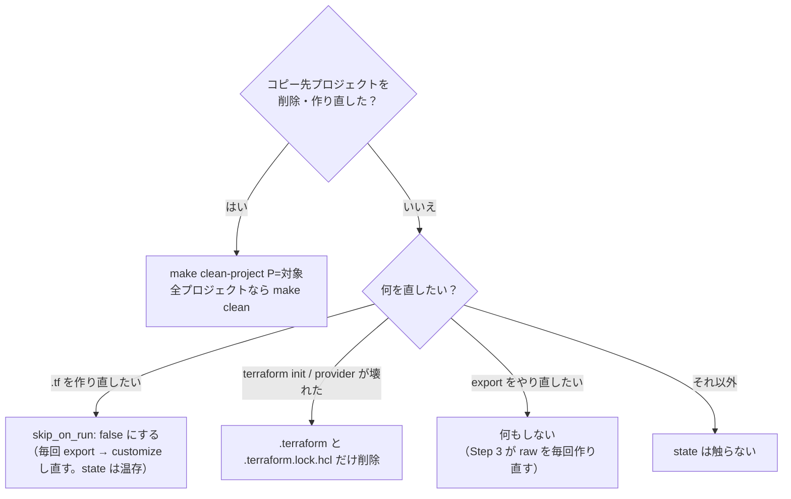
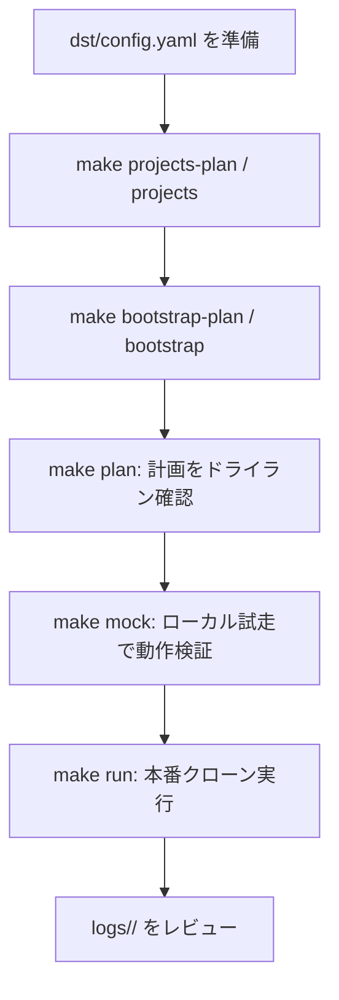
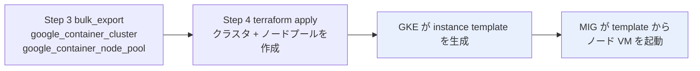
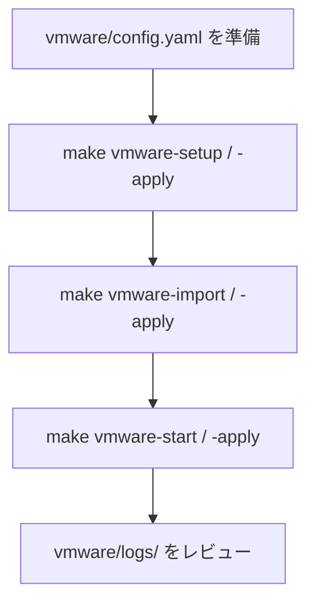

# GCP プロジェクト GCE まるごとコピー ツール (Terraform / IaC ベース)

既存の GCP マルチプロジェクト環境（**Original / コピー元**）を、構成とデータを保持したまま
新しい GCP プロジェクト群（**Destination / コピー先**）へ主に GCE を **まるごとクローン** する運用自動化ツールです。

`dst/config.yaml` の定義に基づき、CAI スキャン → スナップショット検証 → Terraform エクスポート/適用 →
GCE 復元 → データ同期（GCS/BigQuery）までを一連で自動実行します。

> 🔐 **このツールは Original（ORG）プロジェクトに一切書き込みを行いません。**
> コード側で「src 操作は read-only のみ・書き込み動詞は実行前に拒否」を強制しています。認証は、src を一切書き換えたくない場合は **ローカル認証（実行ユーザー本人）がおすすめ**で、SA の権限借用はオプションです（src 書込権を持っていれば実行前に警告 + 続行確認）。
> 詳細は後述の [ORG プロジェクト保護](#-org-プロジェクト保護) を参照してください。

> ☸️ **GKE はクラスタ構成のみをコピーします。** クラスタ / ノードプールの定義は Terraform
> （Step 3 エクスポート → Step 4 適用）で複製します。
> **ノードプールの構成（ノード台数・マシンタイプ・ディスク・配置ゾーン・自動修復/自動アップグレード
> 等）はコピー元からそのまま引き継がれ**、コピー先クラスタが同じ構成のノードを作り直します。
> 引き継がないのは**ノードの GCE VM 実体だけ**です（スナップショットからの復元は行いません。
> ノードは使い捨てのため復元する意味がなく、GKE が作り直したものと同等です）。
> ノードが作られる仕組みと、コピー対象から外している GKE 自動生成リソースの一覧は
> [GKE Standard のノード VM はどうやって作られるか](#-gke-standard-のノード-vm-はどうやって作られるか) を参照してください。

> ⚡ **Cloud Run / Cloud Functions は Terraform ではなく専用ステップでコピーします。**
> リソース定義を Terraform HCL に書き出す `bulk-export` が Cloud Run を確実に扱えないため
> （既定の設定では 1 件も出力せず、設定を変えてもリージョンによって取りこぼします）、
> **Step 4.7 (`serverless_sync`)** がそれぞれのサービス自身の仕組みで複製します
> （Cloud Run は定義 YAML の取り出し / 取り込み、Cloud Functions はソース zip を運んで
> コピー先で再ビルド）。設定は不要で、`make run` を実行すれば動きます。
> **正しく移せない設定を含むものは「中途半端にコピーしない」方針**で、
> `DIFF.md` の要対応に手順つきで出ます。詳細は
> [設定ファイル (config.yaml) の準備](#3-設定ファイル-configyaml-の準備) の
> `steps.serverless_sync` を参照してください。
> PersistentVolume のデータやクラスタ内の k8s オブジェクト（Deployment 等）は対象外なので、
> コピー先クラスタ作成後に **Backup for GKE のリストア**（推奨）または再デプロイで戻してください。
> コピー先クラスタは Backup for GKE のエージェントを**有効化した状態で作成**します（復元の必須要件）。
> **別プロジェクトへの復元には backup channel / restore channel が必要**で、
> 具体的な手順（コピー元でのバックアップ作成・サービスエージェント権限を含む）は
> クラスタごとに `DIFF.md` の「要対応」へ出力されます。

> 📚 **関連ドキュメント**: [architecture/sync-env-flow.md](./architecture/sync-env-flow.md)（実行フロー図）・[PROCEDURE.md](./PROCEDURE.md)（推奨運用フロー）・[SPEC.md](./SPEC.md)（全体仕様）・[dst/SPEC.md](./dst/SPEC.md)（コピー先仕様）・[HISTORY.md](./HISTORY.md)（変更履歴）・[doc/outbound-quarantine-design.md](./doc/outbound-quarantine-design.md)（dst outbound 遮断（検疫）設計）

---

## 前提条件と環境セットアップ

### 0. 前提条件チェックリスト

`make plan` / `make run` を走らせる前に下記が**すべて満たされている**ことを確認してください。
不足があると事前チェック (fail-fast) で停止します（dst への書き込みは発生しません）。詳細は後続の各セクション。

#### A. ローカル環境
- [ ] Python 3.13 以上 / `uv` がインストール済み
- [ ] `gcloud` / `bq` / `terraform` が PATH に通っている
- [ ] `bulk_export` を有効化する場合は `gcloud components install config-connector` 済み
- [ ] **`gcrane`**（`data_sync` 有効時は**必須**。Artifact Registry のイメージ複製に使用。
      **無いと実行前チェックでエラー停止します**。`crane` でも可。`docker` は代替になりません
      → [イメージ複製に gcrane が必須な理由](#-イメージ複製に-gcrane-が必須な理由)）
      ```bash
      go install github.com/google/go-containerregistry/cmd/gcrane@latest
      ```

#### B. 認証
- [ ] `gcloud auth login` と `gcloud auth application-default login`（ADC）でログイン済み
- [ ] （ローカル認証）実行ユーザーが src=読み取り / dst=フォルダ・組織への書き込み権限を保有
- [ ] （Impersonation を使う場合のみ）対象 SA への `roles/iam.serviceAccountTokenCreator` を付与済み

#### C. コピー元 (src) 側
- [ ] 各 src プロジェクトの **プロジェクト ID** を把握している
      （`config.yaml` の `project_mapping.host_project.src` / `service_projects[].src` に記入）
- [ ] 各 src プロジェクトに実行ユーザーの**読み取り権限**を付与済み（ローカル認証）
      → `roles/viewer` だけでは不足します。必要なロール一覧は
      [推奨構成: 最小権限の principal を 1 つ用意する](#推奨構成-最小権限の-principal-を-1-つ用意する) を参照
      → Impersonation を使う場合は `scripts/bootstrap_src_sa.sh --apply` で read-only SA を一括投入（`roles/viewer` + `roles/cloudasset.viewer` + 実行ユーザーへ `roles/iam.serviceAccountTokenCreator`）
- [ ] 移行対象の **全 GCE VM に期限内スナップショット**（既定 30 日以内）が存在
      → 無いと Step 2 `gce_snapshot` がエラーで停止（`make plan` でも検出）
      → 手動作成: `gcloud compute disks snapshot <disk> --snapshot-names=<name> --zone=<zone> --project=<src>`
      → 期限は `config.yaml` の `steps.gce_snapshot.max_age_days` で変更可
      → **GKE ノードの VM は検証・コピーの対象外**なのでスナップショットは不要です
        （`goog-gke-node` ラベルで判定。コピー先クラスタがノードを作り直します）

#### D. コピー先 (dst) 側
- [ ] **組織 ID** (`organizations/<id>`) → `bootstrap.org_id`
- [ ] **フォルダ ID** (任意) → `bootstrap.folder_id`
- [ ] **請求先アカウント ID** (`billingAccounts/<id>`) → `bootstrap.billing_account`
- [ ] dst プロジェクトは `make projects` で新規作成（または既存を使う）

#### E. 設定ファイル
- [ ] `dst/config.yaml` を `dst/config.yaml.template` から複製・編集済み
- [ ] `vpc_sc.enabled=true` にする場合は `access_policy` / `perimeter` / `billing_project` を明示
- [ ] `rename_rules.gcs.value` を `"auto"` または固定文字列に設定

---

### 1. ツール要件
- **Python 3.13 以上**（`pyproject.toml` の `requires-python` に合わせる）
- **`uv`**（Python パッケージ管理・仮想環境ツール）
  ```bash
  curl -sSf https://rye.astral.sh/get | bash   # または pipx install uv
  ```
- **`terraform`**（**必須**: Step 4 のインフラ再現で使用）
  ```bash
  # 例: 公式バイナリを導入（Debian/Ubuntu）
  terraform version   # 確認（バージョンが出れば OK）
  # 未導入の場合: https://developer.hashicorp.com/terraform/install
  ```
- **`gcloud` / `bq`**（GCP CLI）
- **Config Connector**（`bulk_export` 有効時のみ**必須**）: Step 3 の `bulk-export` が依存する gcloud コンポーネント。
  ```bash
  gcloud components install config-connector
  ```
- **`gcrane`**（`data_sync` 有効時は**必須**）: Step 3.7 のコンテナイメージ複製で使用します
  （`gcloud` にイメージコピー機能が無いため）。`crane` でも構いません。
  ```bash
  go install github.com/google/go-containerregistry/cmd/gcrane@latest
  # バイナリ配布: https://github.com/google/go-containerregistry/releases
  ```
  **どちらも無い場合は実行前チェックがエラーで停止します**（`make plan` でも検出）。
  **`docker` は代替になりません** — 理由は
  [イメージ複製に gcrane が必須な理由](#-イメージ複製に-gcrane-が必須な理由) を参照。
  イメージ複製が不要なら `steps.data_sync.artifact_registry.enabled: false` にしてください。

> ✅ **実行前の自動チェック（fail-fast）**
> `make plan` / `make run` / `make mock` は開始時に下記を検証し、不備があれば
> **dst へ書き込まずに全件列挙して即停止**します（Mock は CLI / SA チェックをスキップ）。
>
> - **config.yaml 検証**: ORG 保護（src/dst マッピング欠落・`src=dst`・ID 衝突）と、有効ステップの
>   設定不備（`vpc_sc` の `billing_project` / `access_policy` / `perimeter` 空、`rename_rules.gcs.method` 不正、
>   `gce_snapshot.max_age_days` が非正、`bulk_export.resource_types` / `export_resource_types` の
>   書式誤り（Terraform 型と KRM Kind の取り違え）、`storage_path` が `gs://` でない など）。
> - **CLI 前提チェック**: 有効ステップが使う `gcloud` / `terraform` / `bq` / `config-connector` /
>   **`gcrane`**（イメージ複製。`crane` でも可）の存在。
> - **SA 事前チェック**: 借用 SA の実在・借用可否と代表権限（src=読取 / dst=書込）。代表値の検証で、全リソース種は網羅しません。
> - **コピー先プロジェクトの実在チェック**: 全 dst を `projects describe` し、ACTIVE でなければ
>   何も書き込まずに停止して `make projects` を案内します（config の dst を新 ID に変えたまま
>   作成を忘れると、以前は 30 分走った末に全滅していました）。
> - **多重起動ガード**: 同じ作業ディレクトリで `make run` / `make plan` が並走すると
>   Terraform state が相互破壊されるため、2 つ目の起動は即エラーで停止します
>   （先行プロセスが異常終了しても自動解除されます）。
>
> 💡 ローカル認証（`*_impersonate_service_account` が空）では SA チェックが ADC 経路に切り替わり、
> src 書込権を検出すると警告 + 続行確認します（自動承認は `make plan YES=1` / `make run YES=1`）。詳細は §2 を参照。

### 2. GCP 認証
サービスアカウントキー (JSON) は使用しません。認証方法は 2 つあります。
**src（オリジナル）を一切書き換えたくない場合は、SA を使わないローカル認証がおすすめ**です。

#### src を書き換えたくない場合のおすすめ: ローカル認証（実行ユーザー本人の権限で動かす）
`config.yaml` の `*_impersonate_service_account` を **すべて空**にすると、ログイン中の
実行ユーザー（および ADC）の権限で動作します。

1. 事前に実行ユーザーへ権限を付与
   - **コピー元 (src)**: 各 src プロジェクトに **読み取り専用**（`roles/viewer` 相当）。
   - **コピー先 (dst)**: プロジェクト作成先の**フォルダ / 組織への書き込み**（プロジェクト作成）と、
     各 dst プロジェクトの**リソース作成・編集**（Editor 相当）。
2. gcloud と ADC の両方にログイン
   ```bash
   gcloud auth login
   gcloud auth application-default login
   ```
3. `src_impersonate_service_account` / `dst_impersonate_service_account` は空のままにする。

> ✅ **利点**: src 側に SA を作らず、src の IAM を一切書き換えずに済みます
> （オリジナルのプロジェクトを変更したくない要件に最適）。src への書き込みはコード上
> `is_src_read_only` ガードで常時禁止です。

#### オプション: サービスアカウントの権限借用 (Impersonation)
個人権限と分離し、監査・最小権限で運用したい場合は専用 SA を使えます。
`*_impersonate_service_account` に SA のメールアドレスを指定してください。

- 実行ユーザーに、対象 SA への `roles/iam.serviceAccountTokenCreator`（借用権限）が必要。
- **dst**: 大量のリソース作成・削除が走るため、Editor 相当の専用 SA を指定。
- **src**: 借用する場合は src 側に SA 作成 + 読取権限付与が必要です
  （= **オリジナルへの IAM 書き込みが発生**します）。

> 💡 **src を借用する場合のセットアップ**
> 専用 SA で src を読みたい場合は `src_impersonate_service_account` にメールを設定。
> その SA を src プロジェクトに作成 + 読取権限付与する一括スクリプトを用意しています。
> **このスクリプトの実行だけは src(ORG) への IAM 書き込みを伴う**ため、`sync_env.py` の ORG 保護とは
> 意図的に分離した手動セットアップ用です（既定は dry-run）。**ローカル認証（推奨）なら不要**。
> ```bash
> scripts/bootstrap_src_sa.sh                          # dry-run（実行されるコマンドの表示のみ）
> scripts/bootstrap_src_sa.sh --apply                  # 実際に SA 作成・ロール付与
> scripts/bootstrap_src_sa.sh --apply --impersonator user:foo@example.com
> ```
> 付与内容（各 src プロジェクトごと）: `roles/viewer`（compute / GCS / BigQuery の read）、
> `roles/cloudasset.viewer`（CAI スキャン・bulk-export 用）、および実行アカウントへの
> `roles/iam.serviceAccountTokenCreator`（= SA 借用権限）。

> 🧰 **コピー先 (dst) 側の一括ブートストラップ（`make bootstrap-plan` / `make bootstrap`）**
> 新しい dst プロジェクト群を用意した直後は、(a) dst SA、(b) dst SA に対する src 読取権限、
> (c) Shared VPC 構成 をまとめてセットアップする Make ターゲットを用意しています（`projects*` と同じく裸 = 実適用 / `-plan` = dry-run）。
> **認証パターンに関わらず `make bootstrap-plan` → `make bootstrap` で OK です**。(a)(b) は Impersonation（オプション）用で、
> 借用 SA 未指定（ローカル認証・推奨）ならスクリプトが「対象なし」と判定して自動スキップし、(c) Shared VPC 構成だけが適用されます。
> ```bash
> make bootstrap-plan     # 3 つを順に dry-run（実行されるコマンドの表示のみ）
> make bootstrap          # 3 つを --apply で実行（dst と src(ORG) に IAM/構成を書き込みます）
> # 個別に流したい場合（裸 = 実適用 / -plan = dry-run）
> make bootstrap-dst-sa                 # dst SA 作成 + editor/storage.admin/bigquery.admin + tokenCreator
> make bootstrap-cross-project          # dst SA に src の migrationSrcReader + bigquery.dataViewer
> make bootstrap-shared-vpc             # host を Shared VPC 化、svc をアタッチ、networkUser 付与
> ```
> 中身（呼び出されるスクリプト）:
> - `scripts/bootstrap_dst_sa.sh` … dst SA を各 dst プロジェクトに作成し、`roles/editor`・`roles/storage.admin`・`roles/bigquery.admin`・`roles/iam.roleAdmin`・`roles/resourcemanager.projectIamAdmin`・`roles/iam.serviceAccountUser` と、実行アカウントへの `roles/iam.serviceAccountTokenCreator` を付与。
>   `projectIamAdmin` は Step 5.7 (`iam_sync`) で src SA のロールを dst SA へ付与するために必要です（`roles/editor` に `setIamPolicy` は含まれません）。この SA が「任意の principal に任意のロールを配れる」力を持つ点は理解した上で運用してください。IAM 複製が不要なら `steps.iam_sync.enabled: false` にしてこのロールを外せます。
>   `iam.serviceAccountUser` は Step 4.7 (`serverless_sync`) で Cloud Run / Functions に実行 SA を指定する（`actAs`）ために必要です（`roles/editor` には含まれません）。**既存環境では再実行が必要です。**
> - `scripts/bootstrap_cross_project.sh` … 各 src プロジェクトに read-only カスタムロール `migrationSrcReader` を作成し、対応する dst SA に付与（さらに `roles/bigquery.dataViewer`）。**src(ORG) への read-only IAM 付与**を伴うため、`sync_env.py` の ORG 保護から意図的に分離されています。
> - `scripts/bootstrap_shared_vpc.sh` … dst host を Shared VPC ホストにし、dst svc プロジェクトをアタッチ、各 svc の cloudservices/compute SA と svc 借用 SA に `roles/compute.networkUser` を付与。
>
> SA 事前チェックで dst SA の借用に失敗した場合、`make plan` / `make run` の停止メッセージに
> 上記コマンドが自動表示されます。

#### 推奨構成: 最小権限の principal を 1 つ用意する

**移行実行専用の principal（ユーザーアカウントまたは SA）を 1 つ用意し、src には読み取りのみ・dst には書き込みを付ける**のが、いま取れる最も安全な構成です。

| 対象 | 付与するロール | 理由 |
| :--- | :--- | :--- |
| **src（全プロジェクト）** | `roles/viewer` | compute / GCS の read、`resourcemanager.projects.getIamPolicy`（Step 5.7）、`serviceusage.services.list`（Step 1.5）、`run.services.*` / `cloudfunctions.functions.*` の read（Step 4.7）を含む |
| | `roles/cloudasset.viewer` | `cloudasset.assets.searchAllResources`（Step 1 `cai_scan` / Step 3 `bulk_export`）。**`roles/viewer` には含まれません** |
| | `roles/bigquery.dataViewer` | BigQuery のデータ読み取り（Step 6 `data_sync`） |
| | `migrationSrcReader`（カスタム） | `compute.snapshots.useReadOnly` / `run.services.get` / `cloudfunctions.functions.get` / `storage.objects.get`（関数ソース zip）など、定義済みロールで賄えない read 権限。`scripts/bootstrap_cross_project.sh` が作成 |
| **dst（全プロジェクト）** | `bootstrap_dst_sa.sh` の `ROLES` 相当 | `roles/editor` + `storage.admin` + `bigquery.admin` + `iam.roleAdmin` + `resourcemanager.projectIamAdmin` + `iam.serviceAccountUser`。dst では事実上 owner 相当の権限が必要です |

> ⚠️ **`roles/viewer` だけでは足りません。** 上表の 4 つを揃えないと Step 1 / 3 / 5 / 6 が権限不足で失敗します。

**なぜ安全か**: src 側に書き込み権限が無ければ、コードのバグや将来の改修があっても API が 403 で弾きます。
これは `is_src_read_only` ガード（コードレベル）の**外側**にある保証で、多層防御になります。
さらに SA 事前チェックが src の代表的な書込権を実測するため、**`[y/N]` の続行確認が一度も出なければ「書込権を持っていない」ことの実行時証拠**になります（出た場合は最小権限になっていないシグナル）。

**ADC 直接指定と Impersonation のどちらでも使えます**が、`src_impersonate_service_account` に指定する方がわずかに優れます（src 読み取りに使う資格情報を実行ユーザー本人と明示的に分離でき、監査ログでも区別できるため）。

> 📌 **注意**: `bootstrap_src_sa.sh` / `bootstrap_cross_project.sh` は **src(ORG) に IAM を書き込みます**。
> read-only の principal では実行できないので、これらは別の管理者アカウントで先に済ませてから、
> 移行本体を最小権限 principal で回してください。

### 3. 設定ファイル (config.yaml) の準備
テンプレートからコピーして、環境に合わせて編集します。

```bash
cp dst/config.yaml.template dst/config.yaml
```

`dst/config.yaml` で定義する主な項目:
- **`project_mapping`**: コピー元 (src) とコピー先 (dst) のプロジェクト ID、および借用 SA
  (`src_impersonate_service_account` / `dst_impersonate_service_account` — どちらもオプション)。
  **src を書き換えたくない場合は両方空（ローカル認証）がおすすめ**。権限借用したい場合のみ SA を指定します（理由は §2 参照）。
  `host_project` と `service_projects` を定義します。
  - **`host_project.skip: true`** (オプション): 既に構築済みの dst host を再利用する場合に指定。
    host を全ステップから除外（`create_projects` / SA preflight / cai_scan / bulk_export /
    terraform_apply / network_firewall / gce_restore / data_sync）し、
    `terraform/active/<src_host>/` の state も孤児削除から保護して温存。
    ID / プロジェクト番号の置換マップには host を残すため、service project 内の host 参照
    （Shared VPC ネットワーク URL 等）は正しく dst へ書き換わる。
  - **`standalone_projects`** (オプション): 共有 VPC に**所属しない**独立プロジェクトのリスト
    （エントリの形式は `service_projects` と同じ）。自前の VPC/subnet と
    classic FW rule / network firewall policy は Step 4.5 で src → dst プロジェクトへ
    直接同期され、VM 復元時の network 参照も自プロジェクトの dst に書き換わる。
    Shared VPC 化 (`make bootstrap-shared-vpc`) の対象外。
    **standalone_projects のみの構成では `host_project` / `service_projects` を丸ごと省略可能**
    （その場合 `bootstrap-shared-vpc` は「対象なし」として自動スキップ）。
- **`rename_rules`**: GCS バケット等のグローバルユニークなリソースのリネーム規則。
  `gcs.value` に固定文字列を指定するか、`"auto"` にすると日付ベースの一意 suffix
  （例: `-dst-MMDDHHMM`）を自動生成します。生成値は `terraform/.gcs_rename_value` に
  永続化され、`make plan` / `make run` / `skip_on_run` 間で同じ値が再利用されます
  （別名で作り直す場合はこのファイルを削除）。
- **`steps`**: 各ステップ (`cai_scan` / `enable_apis` / `gce_snapshot` / `bulk_export` / `terraform_apply` / `serverless_sync` / `network_firewall` / `gce_restore` / `iam_sync` / `data_sync` / `vpc_sc`) の有効/無効と個別設定（スナップショット期限など）。
  `bulk_export.skip_on_run: true` にすると本番実行 (`make run`) では export/customize を
  スキップし、`make plan` で生成済みの `terraform/active/` を再利用して高速化します
  （`make plan` 自体は常に最新を取り直します）。実行時に一度だけ変えるなら
  `make run SKIP_ON_RUN=0`（必ず再実行）/ `SKIP_ON_RUN=1`（再利用）。
  - **`bulk_export.export_resource_types` / `storage_path` / `retries` / `retry_wait_seconds`**:
    リソース数の多いコピー元で `error waiting for operation:` (config-connector の
    内部タイムアウト。**延長オプションは存在しません**) が出る場合の対策です。
    ```yaml
    steps:
      bulk_export:
        export_resource_types: "auto"   # 対応 Kind を自動判定（推奨・k8s は自動で対象外）
        # export_resource_types: ["ComputeInstance", "ComputeNetwork"]  # 明示指定も可
        # storage_path: "gs://my-bucket/prefix"   # 一時バケット作成を省く（上と併用不可・キャッシュではない）
        retries: 2                # 既定 2（タイムアウトに短間隔リトライは無意味なため）
        retry_wait_seconds: 180   # 既定 180 秒
    ```
    Kind の一覧は `gcloud beta resource-config list-resource-types --project=<コピー元>`。
    **`resource_types`（Terraform 型）とは別の設定**なので取り違えに注意してください
    （誤りは実行前にエラーで停止します）。
  - **`bulk_export.resource_types`**: 移行対象のリソース種別を絞り込みます（省略時は全量）。
    ```yaml
    steps:
      bulk_export:
        resource_types:
          exclude: ["google_cloud_run_*", "google_container_*"]  # 除外
          # include: ["google_compute_*"]                         # 許可リスト
    ```
    Terraform リソース型のワイルドカード指定で、`exclude` が `include` より優先されます。
    除外した種別は DIFF.md でも「参考（設定どおり）」になり要対応に混ざりません。
    `google_` で始まらないパターンは実行前にエラーで停止します（書き間違いによる
    「全部除外」を防ぐため）。
  - **`enable_apis`** (Step 1.5 / Step 3.5): **src で有効な API を dst でも有効化**します。
    **キー未指定でも有効**（設定不要で動きます）。無効にするときだけ `enabled: false`。
    - dst で API が無効だと Step 4 の `terraform apply` が
      `<API> has not been used in project ... before or it is disabled` の 403 で止まります
      （**GKE = `container.googleapis.com`** が典型）。これを先回りで防ぐステップです。
    - 有効 API の取得元は `gcloud services list --enabled`（src read-only）と Step 1 の CAI 出力
      （`serviceusage.googleapis.com/Service`）の 2 系統。片方が読めなくても動きます。
      加えて**有効ステップが必ず使う API**（compute / storage / bigquery / iam 等）も足します。
    - dst で既に有効な API は呼ばず、**差分だけ** 20 件ずつまとめて有効化 → 伝播待ち
      (`wait_seconds`、既定 120 秒) を行います。再実行時は差分ゼロで即完了します。
    - **2 段構えで実行します**。必要な API が確定するのは Step 3（Terraform コード生成）
      完了後のため、Step 1.5 では src 由来を先行有効化して伝播時間を稼ぎ、
      **Step 3.5（Terraform 実行の直前）で `.tf` 由来を含む全量を有効化し、
      「全て有効として見えること」を確認**してから apply に進みます。
    - 有効化に失敗した API は**エラーにせず** WARNING + 手動コマンドを案内します
      （本当に必要な API なら後続ステップが本来のエラーで止めます）。
      dst で不要な API は `skip_apis`、逆に足したい API は `extra_apis` に指定してください。
  - **`serverless_sync`** (Step 4.7): **Cloud Run サービス / ジョブ**と **Cloud Functions**
    (第 1・第 2 世代) を src → dst に複製します。**キー未指定でも有効**（設定不要で動きます）。
    無効にするときだけ `enabled: false`。
    - **なぜ専用ステップなのか**: `bulk-export` は Cloud Run を確実に出力できません。
      既定の `bulk_export.export_resource_types: "auto"` では **1 件も出力しません**
      （gcloud に対応 Kind を問い合わせる一覧で `RunService` が「bulk-export 非対応」と
      申告されるため、CAI へ問い合わせる段階で対象から外れます）。`auto` をやめて
      絞り込み無しにすると一部は出力されますが、**リージョンによって取りこぼします**
      （実測 5 件中 3 件）。どちらにしても Terraform では揃わないので、
      それぞれのサービス自身の仕組みを使います。
      - Cloud Run … 定義を YAML で書き出し、dst 用に書き換えて取り込む
        （イメージは Step 3.7 が複製済みのものを digest ごと参照）
      - Cloud Functions … ソース zip を dst のバケットへ運び、**dst 側で再ビルド**
        （イメージ複製は不要。`<dst プロジェクト ID>-fn-source-migration` バケットを
        関数と同じリージョンに冪等作成します。`source_bucket` で変更可）
    - **関数ビルド専用 SA の自動用意**: Cloud Functions のビルドは dst の Cloud Build が
      実行しますが、既定のビルド SA（`<番号>-compute@developer.gserviceaccount.com`）は
      2024-05-03 以降に作られたプロジェクトでは組織ポリシー
      `constraints/iam.automaticIamGrantsForDefaultServiceAccounts` によりロールが
      1 つも付かず、**そのままでは全関数が
      `missing permission on the build service account` でビルドに失敗します**。
      複製前に dst プロジェクトごとに専用 SA
      `fn-build@<dst>.iam.gserviceaccount.com` を冪等作成し、公式指定の最小ロール
      (`roles/logging.logWriter` / `roles/artifactregistry.writer` /
      `roles/storage.objectViewer`) を付与して、deploy に
      `--build-service-account` で明示します（gen1 / gen2 とも対応）。
      **既定 SA はランタイム ID も兼ねる**ため、そこに広い
      `roles/cloudbuild.builds.builder` を足す方法は採りません
      （移行と無関係のワークロードの権限まで広がる / dst ORG が
      `cloudbuild.useComputeServiceAccount` を無効にしていると効かない）。
      用意した事実は WARNING + `DIFF.md` の「確認」に出ます。
      - 自前のビルド SA を使う: `build_service_account: <email>`（作成・権限付与は
        利用者側の責任。ツールは指定するだけ）
      - 自動用意そのものを止める: `grant_build_service_account: false`
        （既定ビルド SA に `roles/cloudbuild.builds.builder` が必要）
      - この SA は関数の設定に記録されるため、**移行後も残す前提**です
        （削除すると再デプロイが失敗します）
    - 環境変数・メモリ / CPU・タイムアウト・インスタンス数・同時実行数・ingress・
      ヘルスチェック等は src の内容がそのまま引き継がれます。
    - **「中途半端にコピーしない」方針**: 以下は**複製せず** `DIFF.md` の要対応に手順つきで
      出します。参照先が src を指したままのリソースを dst に作ると、差分レポートにも
      現れず（**存在はしている**ため）実行時まで壊れていることに気付けないためです。
      - **Cloud Run サービス / ジョブ**: VPC コネクタ / Direct VPC egress / Cloud SQL 接続 /
        Secret Manager 参照 / CMEK / Binary Authorization / サイドカー（複数コンテナ）/
        GPU / 特定リビジョンへのトラフィック固定（カナリア配信・リビジョンタグ）
      - **Cloud Functions**: **イベントトリガ**（Pub/Sub・Cloud Storage 等。
        **HTTP トリガのみ対応**）/ Secret Manager 参照 / VPC コネクタ / CMEK /
        第 1 世代でソース zip を取得できないもの（コンソールやローカルからアップロード
        して作った関数は Google 管理領域にしかソースが無く、gcloud に取得手段がありません）
    - **gen2 Cloud Functions の実体は Cloud Run サービス**です。Run として複製すると
      dst に「Function ではない Run サービス」が生えてトリガーと管理単位を失うため、
      Run 側では複製せず **Function として**複製します。
    - **平文の環境変数**（`*_TOKEN` / `*_SECRET` / `*_WEBHOOK` 等）は **src と同じ値**で
      複製します（`roles/owner` や公開設定と同じ「忠実再現 + 警告」方針）。別 ORG に同じ
      秘密が増えるため、不要なら dst で差し替え / ローテーションしてください
      （`DIFF.md` の「確認」に一覧が出ます）。
    - **実行サービスアカウント**は dst の同名 SA（既定 SA なら dst の既定 SA）に読み替えます。
      読み替えできない / dst に存在しない場合は dst の既定 compute SA で起動するため、
      権限が異なる可能性があります（`DIFF.md` の「確認」に出ます）。
    - **コピー先で見え方が変わるもの**（動くものは同じです）:
      - **デプロイ方法の表示が「ソース」→「コンテナ」になります。** コピー元の
        `run.googleapis.com/build-*` annotation（Cloud Build のビルド ID とソース zip の
        GCS パス）は**コピー元のビルドとバケットを指している**ため落とします。コピー先には
        Step 3.7 が **digest 不変**で複製したコンテナイメージだけが残るので、コンソールは
        「コンテナをデプロイ」と分類します。**実行されるイメージはコピー元と同一 digest** です。
        コピー先でも「ソース」表示にしたい場合は、ソースをコピー先へ置いて
        `gcloud run deploy --source` で再ビルドしてください。
      - **サービス URL は変わります**（プロジェクト番号が変わるため）。コピー元の URL を
        指している設定（DNS・Webhook・フロントエンド）は手動で更新してください。
    - 特定のサービス・ジョブ・関数を除外したいときは `skip_services` に名前を列挙します。
    - 必要権限: src に `run.services.get/list` / `cloudfunctions.functions.get/list` /
      `storage.objects.get`（`bootstrap_cross_project.sh`）、dst に
      `roles/iam.serviceAccountUser`（`bootstrap_dst_sa.sh`）。**既存環境では再実行が必要です。**
      付与していなくても移行は止まりません（複製が警告付きでスキップされます）。

  - **`iam_sync`** (Step 5.7): src の SA に付いている IAM ロールを dst の同名 SA へ複製。
    **キー未指定でも有効**（設定不要で動きます）。無効にするときだけ `enabled: false`。
    - 対象は **src 各プロジェクトの project IAM ポリシー**のうち user-managed SA
      (`<id>@<project>.iam.gserviceaccount.com`) 宛のバインディング。ロール ID と SA email を
      `project_mapping` で dst 側に読み替えて付与し、dst に SA が無ければ空 SA を冪等作成します。
    - **複製しないもの**（いずれも dst の権限が緩む方向には作用しません。理由付きで WARNING）:
      条件付きバインディング / ORG カスタムロール / `project_mapping` 外のプロジェクトの SA・
      カスタムロール / default compute・appspot・Google 管理 service agent /
      SA 自身の IAM ポリシー（誰が借用できるか）/ バケット・データセット等のリソース単位バインディング。
    - **`roles/owner` 等の超高権限ロールも src と同じなら複製します**。付与した場合は実行ログの
      最後に「何を・どこに・なぜ・取消コマンド」を WARNING でまとめて出すので必ずレビューしてください。
    - **既定ランタイム SA（default compute / appspot）は複製対象外ですが、差分を `DIFF.md` に
      出します**。これらは project ごとに別 ID なので「dst にも同等物がある」前提で除外して
      いますが、2024-05-03 以降に作られたプロジェクトでは組織ポリシー
      `constraints/iam.automaticIamGrantsForDefaultServiceAccounts` により
      `roles/editor` が自動付与されず、**存在は同等でも権限は同等になりません**。
      「src の既定 SA が持っていたロール」と「dst に無いもの」を突き合わせて、
      付与コマンド付きの「確認」として出します（自動付与はしません。別 ORG に
      `roles/editor` を勝手に生やさないため）。既定 SA で動く VM / Cloud Run /
      Cloud Functions がある場合は必ず確認してください。
    - dst 側に `roles/resourcemanager.projectIamAdmin` が必要（`bootstrap_dst_sa.sh` が付与）。
      権限が無い場合は**エラーにせず**スキップし、手動用の `add-iam-policy-binding` コマンドを案内します。
  - **`data_sync`** (Step 6 / Step 3.7): GCS バケット・BigQuery のデータ同期に加え、
    **Artifact Registry のコンテナイメージ複製**（実行位置は Terraform より前の Step 3.7）を担当します。
    ```yaml
    steps:
      data_sync:
        enabled: true
        artifact_registry:
          enabled: true            # 省略時も有効。false でイメージ複製のみ無効化
          skip_repos: []           # 複製しないリポジトリ名
          scope: all               # all（既定・全 digest）| tagged（tag 付きのみ）
    ```
    - イメージは**同じ digest** で複製します。Cloud Run は `image = "...@sha256:<digest>"` で
      固定参照するため、digest が変わると参照が解決できません。
    - 複製には **`gcrane`（または `crane`）が必須**です。無い場合は実行前チェックが
      エラーで停止します。理由は
      [イメージ複製に gcrane が必須な理由](#-イメージ複製に-gcrane-が必須な理由) を参照。
    - 既に同じ digest があるイメージは再送しません（2 回目以降はほぼ即完了）。
    - **コピー先 SA にコピー元の `roles/artifactregistry.reader` が必要**です
      （`make bootstrap-cross-project` が付与。既存環境では再実行してください）。
  - **`vpc_sc`** (Step 7): 既存の VPC Service Controls ペリメタへ dst プロジェクトを追加。
    `access_policy` / `perimeter` に加え **`billing_project` が必須**（access-context-manager は
    `--project` を持たず、未指定だとローカル `gcloud config` の無関係なプロジェクトを quota に
    使い `SERVICE_DISABLED` で失敗するため）。安全のため自動補完せず、未設定ならこのステップは
    スキップします。dst ORG 内で API を有効化できるプロジェクト（通常は dst ホスト）を明示してください。
- **`global`**: `dry_run` / `verbose_logging` / `parallel_jobs` / `log_dir` / `org_log_file` / `dst_log_file`。
- **`bootstrap`**: コピー先プロジェクトを新規作成する場合の組織 ID / フォルダ ID（任意） / 請求先アカウント。

---

## 🚀 使い方（Makefile）

| コマンド | 説明 |
| :--- | :--- |
| `make setup` | uv 仮想環境の同期・セットアップ |
| `make projects-plan` | コピー先プロジェクト作成の **ドライラン** |
| `make projects` | コピー先プロジェクトを実際に作成（請求紐付け + API 有効化） |
| `make delete-projects-plan PATTERN=xxx` | `bootstrap.folder_id` 配下の ACTIVE プロジェクトのうち `project_id` に `xxx` を含むものを **一覧表示のみ**（削除なし） |
| `make delete-projects PATTERN=xxx` | 同上を **削除**（6 桁ランダムコードを端末に入力しないと進まない安全策つき。lien も自動解除） |
| `make bootstrap-plan` | dst SA / src 読取権限 / Shared VPC を順に **ドライラン** で表示（借用 SA 未指定の項目は自動スキップ） |
| `make bootstrap` | 上記 3 つを `--apply` で実行（借用 SA 未指定なら Shared VPC のみ適用。SA 指定時は dst と src(ORG) に IAM/構成を書き込み） |
| `make bootstrap-dst-sa` | dst SA 作成 + ロール付与のみ実行（dry-run は `-plan` 付き） |
| `make bootstrap-cross-project` | dst SA → src の読取権限のみ実行（dry-run は `-plan` 付き） |
| `make bootstrap-shared-vpc` | Shared VPC 化のみ実行（dry-run は `-plan` 付き） |
| `make plan` | 移行処理の **ドライラン**（実行計画の表示のみ。ORG 書き込みなし。既存 state / `.dst_project` マーカー / `.gcs_rename_value` は温存） |
| `make mock` | **Mock モード** でローカル試走（GCP 未接続でも動作） |
| `make run` | 移行処理の **本番実行**（dst への書き込みを伴う）。`SKIP_ON_RUN=0\|1` で `bulk_export.skip_on_run` を今回だけ上書き（0=export/customize を必ず再実行） |
| `make test` | 単体テスト (pytest) を実行 |
| `make clean-project P=<project_id>` | 特定プロジェクトの terraform 生成物 (`active/<src>/` + `raw/<src>/`) と state のみ削除。src / dst / `.dst_project` マーカー値のいずれでも解決、他プロジェクトと `.gcs_rename_value` は温存。未知 ID 混在時は何も消さず exit 1（GCP 未接続） |
| `make clean` | terraform 生成物と state を **全プロジェクト分** 削除して初期化（`.gcs_rename_value` も削除。特定プロジェクトのみは `clean-project`） |
| `make clean-all` | `clean` に加えて `logs/` と `cai_export/` も削除 |

各コマンドには `ARGS="..."` で追加の引数を渡せます（例: `make plan ARGS="--config path/to/config.yaml"`）。

> 🗑️ **`make delete-projects` の安全策**
> - **folder スコープに限定**: `bootstrap.folder_id` 配下の ACTIVE プロジェクトを `gcloud projects list --filter="parent.id=<folder_id> parent.type=folder lifecycleState:ACTIVE"` で**実機列挙**して母集団にする。`folder_id` 未設定なら起動時に fail-fast（org root 全体を対象にしない）。`ARGS="--folder-id <id>"` で一時的に上書き可。
> - **config 改変後の旧 dst も削除可能**: 母集団は実機の folder 配下なので、`dst/config.yaml` を新しい dst に書き換えた後でも **folder に残っている過去の dst** を削除できる（config はテーブルの kind/src 補完用に使うのみ）。config に無い候補は `in_cfg=no` として表示される。
> - `PATTERN` 必須・3 文字未満は拒否。folder 列挙結果をさらに project_id 部分一致で絞り込み、削除前にテーブル形式で一覧表示（`# / kind(host|svc|-) / project_id / name / state / lien 数 / src project / in_cfg`）。
> - **PATTERN にマッチしないプロジェクトは出力しない**（folder 内の他用途プロジェクトをスキップ理由付きで列挙する仕様は廃止。ノイズ抑制のため）。
> - 6 桁のランダムコードを端末に表示し、**そのコードを打鍵しない限り削除は実行されません**。
> - lien (`compute.googleapis.com/projects-delete-prevented` 等) が付いていれば `gcloud alpha resource-manager liens delete` で先に解除してから `gcloud projects delete --quiet` を呼ぶ。
> - 既定は `--dry-run`（make ターゲット側で `--no-dry-run` を付与）。並列度は `dst/config.yaml` の `global.parallel_jobs`（既定 8）に従う。

### 🧹 いつ `clean`（state 削除）すべきか

`terraform/active/<src>/terraform.tfstate` は**派生物ではなく「コピー先に何を作ったか」の記録**です。
消すと terraform が作成済みリソースを見失う（＝管理外になる）ため、判断基準は 1 つだけです。

> **コピー先のリソース実体を捨てた（or これから捨てて作り直す）ときだけ消す。**
> それ以外は state を残したまま `.tf` を作り直す。



#### 消す範囲は最小限に

| 症状 / 目的 | 消すもの | 手段 |
| :--- | :--- | :--- |
| コピー元が変わったので export し直したい | `terraform/raw` のみ | 不要（Step 3 が毎回作り直す） |
| `.tf` をきれいに作り直したい | `active/<src>/*.tf` のみ（state 温存） | `bulk_export.skip_on_run: false`（customize が毎回やる） |
| `terraform init` / provider が壊れた | `.terraform` と `.terraform.lock.hcl` のみ | `find terraform -name '.terraform' -prune -exec rm -rf {} +` |
| **コピー先プロジェクトを削除・作り直した** | **state まで** | `make clean-project P=<project_id>` / 全体は `make clean` |
| **移行を最初からやり直す**（コピー先を空にして再現性確認） | state + logs + cai | `make clean-all` |
| state ファイルが壊れて terraform が読めない | 最後の手段 | まず `terraform.tfstate.backup` からの復元を試す |

#### やってはいけない使い方

| やりがち | なぜダメか | 正しい手 |
| :--- | :--- | :--- |
| `already exists` (409) が出たから `clean` | 実体はコピー先に残り state だけ消えるので**次も 409**。悪化します | `terraform import` するか、コピー先の実体を削除 |
| apply が失敗したから `clean` | 失敗原因（権限・API・依存）は state と無関係。作りかけのリソースが管理外に残るだけ | ログの 403 / 409 を直す |
| `.tf` が古い気がするから `clean` | `.tf` は毎回作り直される派生物。state を巻き添えにする必要はありません | `skip_on_run: false` |
| 不要なリソースを消したいから `clean` | state を残して `.tf` を作り直せば、**次の apply が自動で destroy** してくれます | `.tf` だけ再生成 |

> ⚠️ **`make clean` は `terraform/.gcs_rename_value` も削除します。** `rename_rules.gcs.value: "auto"`
> の場合、次回実行で**別の suffix が生成され、既存バケットを adopt できず新しい名前で作り直し**に
> なります（旧バケットは残ります）。特定プロジェクトだけなら、`.gcs_rename_value` を温存する
> `make clean-project P=<project_id>` を使ってください。

> 💡 手打ちの `rm -rf terraform/...` は `.gcs_rename_value` や `.dst_project` マーカーの消し残り／
> 消し過ぎが起きます。リセットは必ず `make clean` 系を使ってください。

---

## 💡 推奨運用フロー



### Step 0: コピー先プロジェクトの準備
```bash
make projects-plan   # 何が作成されるか確認
make projects        # 実際に作成（org_id / billing_account が必要）
```

### Step 0.5: Shared VPC / IAM のブートストラップ
新規 dst プロジェクトでは Shared VPC 構成を整えます。認証パターンに関わらず同じコマンドで実行できます。
```bash
make bootstrap-plan   # dry-run で内容を確認
make bootstrap        # 確認できたら --apply で実行
```
> 💡 借用 SA（`*_impersonate_service_account`）未指定のローカル認証（推奨）では、dst SA 作成と
> src 読取権限付与は「対象なし」として自動スキップされ、Shared VPC 構成だけが適用されます。
> SA を指定している場合は dst SA + cross-project + Shared VPC の 3 つがすべて実行されます。

### Step 1: 実行計画のドライラン確認
本番実行の前に、必ずドライランで実行計画を確認します。
ORG への書き込みは発生しません（src 操作は read-only のみ）。
```bash
make plan
```

> 🔍 **ドライランで計画・検証される項目**（実行順。ログの `ステップ NN` と対応）
>
> | Step | 内容 |
> | :--- | :--- |
> | **1** `cai_scan` | コピー元の有効なリソース一覧を Cloud Asset Inventory で探索。 |
> | **1.5** `enable_apis` | コピー元で有効な API をコピー先にも反映（差分のみ）。dry-run では**有効化予定の一覧を表示するだけ**。 |
> | **2** `gce_snapshot` | 各 VM に期限内（既定 30 日）のスナップショットがあるか検証。なければエラー（**GKE ノード VM は対象外**）。 |
> | **3** `bulk_export` | リソース定義を Terraform HCL としてエクスポートし、プロジェクト ID / GCS 名の置換、参照の Terraform 参照化、provider 非互換の補正などを実施。 |
> | **3.5** `enable_apis` | 生成された `.tf` から必要 API を**確定**させて全量を有効化し、**全て有効と確認**してから次へ進む関門。 |
> | **3.7** `data_sync.artifact_registry` | コンテナイメージを**同じ digest** でコピー先へ複製。**Terraform より前**なのは Cloud Run が digest 固定で参照するため（無いと Step 4 が `Image ... not found`）。 |
> | **4** `terraform_apply` | `terraform plan -out=tfplan` を生成（本番時のみ apply）。 |
> | **4.7** `serverless_sync` | Cloud Run サービス / ジョブと Cloud Functions を複製。移せない設定を含むものは**作らず** `DIFF.md` の要対応へ。dry-run では書き換え内容と実行予定コマンドを表示。 |
> | **4.5** `network_firewall` | classic firewall と Network Firewall Policy を複製（`secure_tag_map` 未登録の tagValues 参照は skip + WARNING）。 |
> | **5** `gce_restore` | スナップショットから復元したディスクで VM を作成・差し替え。 |
> | **5.5** `gce_restore` | 電源状態（TERMINATED / SUSPENDED）をコピー元に合わせる。 |
> | **5.7** `iam_sync` | コピー元 SA の IAM ロールをコピー先の同名 SA へ複製 + Cloud Run の公開設定を複製。 |
> | **6** `data_sync` | GCS バケット（リネーム後）・BigQuery（location 継承）の同期。 |
> | **7** `vpc_sc` | 既存ペリメタへコピー先プロジェクト（番号）を追記。`billing_project` 未設定ならスキップ。 |
> | **99** — | 差分レポート `DIFF.md` を出力（後述）。 |
>
> 📝 **差分レポート (`DIFF.md`)**: 上記完了後に **`logs/<タイムスタンプ>/DIFF.md`** を出力し、リポジトリ直下の `DIFF.md` を最新版への相対 symlink に張り替えます（実体は日付付きで残るので過去実行とも比較可能）。
> CAI が検出した src リソースのうち dst に無いものを、**実害の有無で 2 段階に分類**して出力します
> （放置すると 50 件超になり、本当に手を動かすべき項目が埋もれるため）。
>
> | セクション | 内容 |
> | :--- | :--- |
> | **要対応**（先頭の WHAT / WHY / HOW テーブル） | **dst の動作に必要で、放置すると実害が出るものだけ**。dst 再現用の `gcloud` 作成系コマンドを併記します |
> | **参考**（優先度テーブル → プロジェクト別詳細。**優先度の昇順**） | 実害が無いと言い切れるもの。`P1` = 確認推奨（別ステップが自動対応済みなので結果だけ確認）/ `P2` = 条件付き（src 側にカスタム・取り置きの意図がある場合のみ）/ `P3` = 対応不要 |
>
> 参考に落ちる代表例: user-managed SA は Step 5.7 (`iam_sync`) が dst に作成するので **P1**
> （`iam_sync` を無効にしている場合は要対応）、Cloud NAT の自動 IP (`nat-auto-ip-*`) や
> Google 管理 service agent・`_Default` / `_Required` ログシンクは **P3**、未使用の予約 IP
> (`state=RESERVED`) や誰にも付与されていないカスタムロールは **P2**。
>
> - **判定材料が無いものは必ず「要対応」に倒します**（見落とすより過剰報告を優先する方針）。
> - 専用ステップが複製するもの（`gce_restore` / `network_firewall` / `data_sync` / `enable_apis`）、
>   `_ASSET_COVERAGE` で意図的に対象外としたもの、**GKE クラスタ内の k8s オブジェクト
>   （`k8s.io/*`）** は差分から除外します（件数のみ集計）。
>
> `make plan` 直後に `cat DIFF.md`（= 最新実行）を眺めて、**まず「要対応」だけ手当てする**運用です。

### Step 2: Mock モードでのローカル試走（任意）
実際の GCP 環境や有効な SA がなくても、`make run` 全体のフローをエラーなく試走できます。
```bash
make mock
```
- Mock モードでは外部コマンドを実行せず、ダミーデータで一連の流れをシミュレートします。
- **未対応コマンドは安全のため即停止 (fail-closed)** します。

### Step 3: 本番実行
ドライラン計画に問題がなければ本番実行します。
```bash
make run
```

> 🚀 **クローンのメカニズム**
> 1. **Step 1.5 / 3.5 (`enable_apis`)** で必要な API をコピー先に用意する。1.5 はコピー元由来を先行有効化して伝播時間を稼ぎ、3.5 は生成された `.tf` から確定させた**全量**を有効化して**全て有効と確認**してから Terraform に進む（GKE の `container.googleapis.com` など。無効なままだと `terraform apply` が 403 で止まる）。
> 2. **Step 3.7** でコンテナイメージを複製する（Cloud Run が digest 固定で参照するため Terraform より前）。
> 3. コピー先ホストプロジェクトに、Terraform で VPC・サブネット・Cloud Router・Cloud NAT 等のインフラを再現（bulk-export の HCL を `terraform apply`）。
> 4. **Step 4.7 (`serverless_sync`)** で Cloud Run サービス / ジョブと Cloud Functions を複製（SA・VPC・バケットが Terraform で出来た後、かつ Cloud Run の公開設定を付ける Step 5.7 より前）。
> 5. classic firewall ルールと Network Firewall Policy は **Step 4.5 (`network_firewall`)** で `gcloud` 経由で複製（dst host VPC が出来ている前提。`secure_tag_map` で別 ORG の tagValues 変換、未登録参照は skip + WARNING）。
> 6. Original の有効なスナップショット（期限内）から、コピー先にディスクを復元。
> 7. 復元したブートディスクを VM に差し替えて起動（OS 状態・データごと完全復元）。電源状態（RUNNING / TERMINATED / SUSPENDED）は **Step 5.5** でまとめて反映。
> 8. src の SA に付いていた IAM ロールを **Step 5.7 (`iam_sync`)** で dst の同名 SA へ複製（別 ORG で ID が変わるロールはスキップ + WARNING。`roles/owner` を付与した場合は末尾に警告）。**Cloud Run の「未認証アクセスを許可」もここで複製**します（Step 4.7 でサービスが出来ているので、**1 回の `make run` で公開設定まで入ります**。付与内容は末尾に警告表示）。
> 9. `rename_rules` に基づき GCS バケット等を衝突回避してリネームし、データを同期。
> 10. BigQuery データセットは **src の location を継承** して作成（クロスリージョン失敗を回避）。
> 11. 全移行の最後に、dst プロジェクトを既存の VPC Service Controls ペリメタへ追加（`vpc_sc.billing_project` が必須。未設定ならスキップ）。

> ♻️ **Terraform 適用の冪等性 / state 管理**（再実行しても 409/404 で落ちないための仕組み）
> - **`make plan` は state を消さない**（`clean` 依存を撤去済み）。同一 dst project id なら前回の
>   `terraform/active/<src>/terraform.tfstate` と `.dst_project` マーカーを温存し、次の `make run` は
>   `skip_on_run` の高速パスと冪等 apply に乗ります。
> - dst プロジェクトが前回と変わった project だけ、stale な `terraform.tfstate` を自動破棄して import から
>   やり直します（`active/<src>/.dst_project` マーカー + state 本文の dst 参照有無で判定）。
> - 特定プロジェクトだけ state を明示リセットしたい場合は **`make clean-project P=<project_id>`**
>   （src ID / dst ID / marker 値のいずれでも解決、他プロジェクトと `.gcs_rename_value` は温存）。
>   config から削除済みの旧 dst の掃除もマーカー値で解決できます。
> - `google_storage_bucket` はリネーム後の実名で import し、作成済みバケットを adopt して再 apply を冪等化。
> - 同一プロジェクト内の network URL を `google_compute_network.<label>.self_link` 参照へ書き換え、firewall/subnetwork が network より先に作られて 404 になるのを防止。
> - VM/disk は Step 4 ではなく Step 5 (`gce_restore`) 側で管理し、`make run` の失敗を抑制。

#### ☸️ GKE Standard のノード VM はどうやって作られるか

ノード VM は**このツールが作りません。コピー先の GKE 自身が作ります。**
コピーするのは「クラスタとノードプールの**設計図**」だけです。



青い部分は **GKE の仕事**で、Terraform も本ツールも関与しません。
ノードのディスクは GKE のノードイメージそのもので、その上のコンテナは kubelet が
レジストリから pull し直します。だから**スナップショットからの復元が不要**です。

`google_container_node_pool` の中身はコピー元のまま渡るので、
**ノード台数（`node_count` / オートスケーラー設定）・マシンタイプ・ディスク種別/サイズ・
`node_locations`・自動修復/自動アップグレードは同じ構成で再現**されます。

一方、**GKE が自分で作り直すものは一切コピーしません**（持ち込むと名前衝突や
宙ぶらりんの参照になるため）:

| コピーしないもの | 誰が作るか |
|---|---|
| ノード VM 本体 | MIG がインスタンステンプレートから生成 |
| instance template / MIG / autoscaler / instance group | クラスタ・ノードプール作成時に GKE が生成 |
| `gke-*` / `k8s-*` の firewall ルール・route・health check・target pool | 同上（k8s Service (LoadBalancer) 由来を含む） |

コピー元のノード VM は **Step 2（スナップショット検証）と Step 5（VM 復元）の両方**で
除外されます。判定は名前ではなく **GKE が全ノードに付ける `goog-gke-node` ラベル**が
第一条件です（`gke-` で始まる利用者 VM を誤って除外するとコピー漏れになるため）。

> 💡 クラスタ本体には `initial_node_count = 1` + `remove_default_node_pool = true` を補完します。
> GKE API は「ノードプール 0 個のクラスタ」を作れない一方、既定プールを残すと
> `google_container_node_pool` 側の同名プール作成が 409 になるためで、
> **一時的な既定プールを作って即削除し、実プールは別リソースとして作る**という Terraform の定石です。

#### 🚀 イメージ複製に gcrane が必須な理由

イメージ複製（Step 3.7）には **`gcrane`（または `crane`）が必要**です。無い場合は
**実行前チェックがエラーで停止**します（`docker` があっても代替になりません）。

| | docker | gcrane / crane |
|---|---|---|
| 転送経路 | pull で全レイヤをローカルに落としてから push | **レジストリ間で直接転送**（ローカルに落とさない） |
| コピー先に既にあるレイヤ | 再送する | **blob mount で再送しない** |
| マルチアーキイメージ | 単一プラットフォームに落ちて **digest が変わることがある** | マニフェストリストごと転送し **digest を保つ** |

digest が変わると実害が 2 つ出ます。

1. **Cloud Run の `@sha256:` 固定参照が解決できなくなる**（`Image ... not found`）
2. **再実行時に「コピー先に既にある」と判定されず、毎回同じイメージを再送し続ける**

実際に docker 経路では一部のイメージで digest が変わっていたため、docker は使わない方針に
変更しました（`gcrane` → `crane` の順に PATH を見ます）。

```bash
go install github.com/google/go-containerregistry/cmd/gcrane@latest
# または https://github.com/google/go-containerregistry/releases からバイナリを取得
```

> 💡 **どこに入れるか**: `make run` を実行するマシンです（レジストリ間の転送を中継します）。
> イメージ複製自体が不要なら `steps.data_sync.artifact_registry.enabled: false` にすれば
> このチェックは行われません。

#### 📉 複製するイメージを減らす: `scope: tagged`

Cloud Build は push のたびに tag を新しいイメージへ移すため、**tag の無い digest =
新しいビルドに置き換えられた過去ビルド**です。実測では 87 件中 **64 件（74%）** が
これに該当しました。

```yaml
steps:
  data_sync:
    artifact_registry:
      scope: tagged     # 既定は all（全 digest を複製）
```

- **`.tf` が digest 固定で参照しているイメージは、tag が無くても必ず複製します。**
  Step 3.7 は Step 3（Terraform コード生成）の後に走るので、`active/<src>/*.tf` から
  「これから apply される内容が必要とする digest」を正確に引けます。
  よって **`tagged` にしても Step 4 の apply が `Image ... not found` で落ちることはありません**。
- 除外した件数はログに出ます（黙って減らしません）。
- 既定を `all` にしているのは、下記を失うためです。**該当するなら `all` のままにしてください**:
  - **Cloud Run で過去リビジョンへ戻す**操作（コピー先に古い digest が無くなる）
  - **GKE のワークロード**が tag 無し digest を固定参照している場合
    （本ツールはクラスタ構成のみコピーするため、Pod の image 参照は `.tf` から引けません。
    Backup for GKE で復元するワークロードが該当します）

#### 自動ではコピーされないもの（`DIFF.md` の「要対応」に手順つきで出ます）

技術的に複製できない、または複製すると壊れるリソースは**意図的にスキップ**しています。
実行のたびに再判定するので、**手動で用意すれば次回から自動的にコピー対象へ戻ります**。

| 対象 | 理由 | 対応 |
|---|---|---|
| 自己管理 SSL 証明書 (`google_compute_ssl_certificate`) | 秘密鍵は API から取り出せない | 鍵を持ってコピー先で手動作成。**証明書ができるまでは、それを参照する LB フロント（target proxy / forwarding rule）も保留**します（毎回 404 で止まるのを防ぐため） |
| GKE のワークロード・PV・Secret | クラスタ**構成のみ**を複製する方針 | Backup for GKE で復元（クラスタごとに手順を掲載）または再デプロイ |
| public な Cloud DNS ゾーン | 同じドメインのゾーンを別プロジェクトに作れない場合があり、作れても NS 委任がコピー元を向いたまま | 手動でゾーン作成 + NS 委任の切り替え |
| ドット入り GCS バケット (`*.appspot.com` 等) | ドメイン検証が必要 / Google 管理のシステムバケット | 必要なら `rename_rules.gcs.overrides` でドット無しの名前を指定 |
| Secret Manager の**値** | 秘密情報を自動で写さない方針（入れ物のみ複製） | コピー先で値を投入 |
| 外部 IP アドレス | Google 採番のグローバル資源で同じ値は確保できない | 新しい IP が採番されます（**内部 IP は同じ値のまま複製**） |
| サーバーレス NEG / 前段 LB の一部 | bulk-export が出力しない | コピー先で手動再構築 |
| Container Analysis の occurrence | 過去ビルドの来歴レコード。参照先がコピー先に存在しない | 再ビルドすれば再生成されます |
| VPC / Cloud SQL / Secret / CMEK 等を使う Cloud Run | 参照先がコピー元を指したままの**壊れたサービス**を作ると差分レポートにも現れず気付けない | 依存をコピー先に用意してから手動で `gcloud run services replace`（DIFF に手順を掲載） |
| イベントトリガの Cloud Functions | 参照先のトピック名 / バケット名がコピー先では変わるため、誤ったイベント源を購読しかねない | 依存を用意して手動 `gcloud functions deploy`（**HTTP トリガは自動でコピーされます**） |
| 第 1 世代 Functions のうちソース取得不能なもの | `sourceUploadUrl`（署名付きアップロード URL）しか無く、gcloud にダウンロード手段が無い | コンソールの「ソース」タブから zip を取得して手動デプロイ |

> ⚠️ **`deletion_protection` は `false` で作成されます**（Cloud Run / GKE / Cloud SQL）。
> コピー元の設定に出力されない項目で、既定の `true` のままだと**途中で失敗したリソースを次回作り直せず移行が詰む**ためです。
> 本番切り替え時に `true` へ戻してください（対象は `DIFF.md` の「確認」に一覧されます）。

---

## 🧩 オプション運用フロー: VMware VMDK → GCE インポート (`make vmware-*`)

VMware からエクスポートした VMDK を GCS 経由で **Migrate to VMs API**（`gcloud migration vms image-imports create`）でカスタムイメージ化し、
指定構成の GCE インスタンスとして起動するためのワークフローです。本体 (`dst/`) のパイプラインとは独立しており、
[`vmware/config.yaml`](./vmware/config.yaml) を Single Source of Truth とします。

> 💡 通常運用では **不要** です。VMware からの持ち込みが必要な場合のみ実施してください。
> 設定ファイル切替: `make vmware-setup-apply VMWARE_CONFIG=vmware/other.yaml`



設定ファイル: [`vmware/config.yaml`](./vmware/config.yaml)（テンプレート: [`vmware/config.yaml.template`](./vmware/config.yaml.template)）

| セクション | 用途 |
| :--- | :--- |
| `global` | 出力先 project / region / zone / dry_run / ログ設定 |
| `source.disks[]` | import 対象 VMDK の GCS URI（`boot: true` を 1 本、`boot: false` をデータディスクとして複数指定可） |
| `image_import` | image 名 prefix、ライセンスタイプ（省略可）、Migration host/target project 分離構成（省略可） |
| `instance` | machine_type、boot disk 設定、追加ディスク、service account、labels、tags、metadata |
| `network` | VPC / subnetwork（Shared VPC は `host_project` 指定）、内部 IP（予約 address 名 or 直接 IP）、外部 IP 有無・tier |

### Step V0: 設定ファイルの準備
```bash
cp vmware/config.yaml.template vmware/config.yaml
# project / region / zone / source.disks[] / instance / network を編集
```

### Step V1: setup（API 有効化・SA 権限・IP 予約）
```bash
make vmware-setup         # ドライラン（実行されるコマンドの表示のみ）
make vmware-setup-apply   # --apply で実行
```
- 必要 API の有効化: `compute` / `storage` / `vmmigration` / `iam`
- Migrate to VMs の TargetProject 登録
- vmmigration SA に source bucket への `roles/storage.objectViewer` を付与
- 内部固定 IP / 外部 static IP の予約

### Step V2: import（VMDK → カスタムイメージ化、非同期）
```bash
make vmware-import         # ドライラン
make vmware-import-apply   # --apply で実行（非同期投入）
```
- `source.disks[]` の各 VMDK を `gcloud migration vms image-imports create` でカスタムイメージ化
- `boot: true` は OS イメージとして、`boot: false` は `--skip-os-adaptation` 付きでデータディスクとして
- 完了確認は `gcloud migration vms image-imports describe` でポーリング

### Step V3: start（GCE インスタンス作成・起動）
```bash
make vmware-start          # ドライラン
make vmware-start-apply    # --apply で実行
```
- boot image から `gcloud compute instances create`（machine_type / SA / labels / tags / 内部 static IP / 外部 IP は config に従う）
- データディスクがあれば対応イメージから `gcloud compute disks create` → `gcloud compute instances attach-disk`

### 一気通貫実行 / クリーンアップ
```bash
make vmware-all         # V1 → V2 → V3 を順次（dry_run は config に従う）
make vmware-all-apply   # 同上、--apply で全ステップ実行
make vmware-clean       # vmware/logs/ を削除
```

> `image_import.target_project_host` / `target_project_name` は Migration host project と target project を分離する構成（省略時は `global.project_id` を使用）。
> 本ワークフローは `sync_env.py` を経由しないため、`dst/config.yaml` / ORG 保護ガード / SA 事前チェックは適用されません。

---

## 🔐 ORG プロジェクト保護

このツールは「コピー元 (ORG) には絶対に変更を加えない」ことを **運用ルールではなくコードで強制** します。

| 仕組み | 内容 |
| :--- | :--- |
| **side による操作分類** | すべての外部コマンドは `side="src" / "dst" / "local"` のいずれかで実行されます。 |
| **src は read-only 強制** | `side="src"` のコマンドに書き込み動詞（`create / delete / update / stop / start / attach / detach / mk / cp / rsync / apply` 等）が含まれていたら、**実行前に拒否**して停止します。 |
| **ローカル認証 / 借用 SA（src を変えないならローカル認証がおすすめ）** | `impersonate_sa` 未指定の場合はローカル認証（gcloud のアクティブアカウント / ADC）で動作します。**src 書込権を持っていれば**事前チェックで警告 + 続行確認（自動承認は `--yes` / `-y` = `make plan YES=1` / `make run YES=1`。環境変数での自動承認は「設定したまま忘れる」事故防止のため提供しません）。`side="src"` のコマンドそのものに対する書込動詞拒否ガード (`is_src_read_only`) は impersonate の有無にかかわらず常時有効です。 |
| **設定バリデーション** | `src == dst`、dst が他の src と衝突、`service_projects` が空 等を検出すると、処理を何もせずに停止します。 |
| **SA 事前チェック** | 実行前に借用 SA の**実在・借用可否・代表権限**（src=読取 / dst=書込）を検証し、不足を検出したら全件列挙して停止します。借用 SA 未指定のプロジェクトはローカル認証の **src 書込権チェック + 続行確認** に切り替わります（`make plan` でも実行、Mock はスキップ）。 |
| **Mock は fail-closed** | Mock モードで未対応のコマンドが来たら、本物実行に進ませず即停止します。 |

これらにより、`config.yaml` の設定ミスやヒューマンエラーがあっても ORG への書き込みが発生しません。

---

## 🔍 ログ仕様（レビューしやすさ重視）

実行のたびに **`logs/<タイムスタンプ>/` ディレクトリ** が新規作成され、その中に
コピー元操作ログ `org.log` / コピー先操作ログ `dst.log` / 差分レポート `DIFF.md` が分離して記録されます（追記による履歴累積はしません）。

- **日本語で記録**: 各操作の「実行内容」を日本語の補足説明付きで出力。
- **ステップ単位でグループ化**: `━━━━` バーで `ステップ N: タイトル (対象 X 件)` を区切り表示。
  小数のステップは**小数点を省いた番号**で出ます（Step 1.5 → `ステップ 15`、3.5 → `ステップ 35`、3.7 → `ステップ 37`、4.5 → `ステップ 45`、4.7 → `ステップ 47`、5.7 → `ステップ 57`、差分レポート → `ステップ 99`）。
- **アクションの記号化**: `✓ スキップ / + 作成 / − 削除 / ✗ 失敗` で一目で判別。
- **スレッドタグ**: 並列実行時、各ログ行に `[main]` / `[cai-scan_0]` 等のタグが自動付与され、`grep` で追跡可能。
- **末尾サマリ**: 実行時間 / 読取成功 / 書込成功 / スキップ / 失敗 / Mock 実行 / ログパスを出力。
- **詳細ログ**: `verbose_logging: true` のとき、生の `gcloud` / `terraform` コマンド文字列と STDOUT を DEBUG レベルでファイルに記録（コンソールは INFO のみ）。
- **`DIFF.md` の最新版**: リポジトリ直下の `DIFF.md` は `logs/<タイムスタンプ>/DIFF.md` への**相対 symlink**として張り替えられます。`cat DIFF.md` で常に最新の差分レポートを参照できます（実体は日付付きで保存され続けるので、過去実行とも比較可能）。

```bash
# 直近の実行ログを確認
ls -t logs/ | head -1
tail -f logs/$(ls -t logs/ | head -1)/dst.log
# 最新の差分レポート（symlink 経由）
cat DIFF.md
# 過去実行の差分レポートを直接見る
ls -1 logs/*/DIFF.md
```

---

## 🛠️ その他

### 単体テストの実行
ORG 保護ロジック、HCL カスタマイズ（置換エンジン）、設定バリデーション等をローカルで検証します（GCP 実機接続は不要）。
```bash
make test
```

### 変更履歴
変更内容と理由は [`HISTORY.md`](./HISTORY.md) に日付の新しい順で記録しています。

### 実行フロー図
[`architecture/sync-env-flow.md`](./architecture/sync-env-flow.md) に、`make run` が Step 0 から Step 99 まで**何を判定して、どこで止まり・どこで複製をやめ・どこで警告だけ出すか**を 8 枚のフロー図でまとめています（起動前チェックの停止条件、`.tf` の間引き判定、GKE 除外、`terraform apply` の内部、サーバーレス複製、VM 復元と電源状態、IAM 複製）。GitHub 上でそのまま図が表示されます。

### 仕様書
- [`SPEC.md`](./SPEC.md) / [`dst/SPEC.md`](./dst/SPEC.md): 詳細仕様。
- [`PROCEDURE.md`](./PROCEDURE.md): 推奨手順と要件。
- [`doc/outbound-quarantine-design.md`](./doc/outbound-quarantine-design.md): dst 環境の outbound 遮断（検疫）設計 — egress deny + Private Google Access + VPC-SC。

---

## 📎 Appendix: コピー元 (ORG) 環境をゼロから構築する (`make org*`)

> 通常運用では **不要** です。本ツールの主目的は「既存コピー元 → 新コピー先のクローン」であり、
> コピー元は普通すでに存在しています。検証 / デモ用に「コピー元っぽい環境」を一から
> 用意したい場合だけ以下を使ってください。

`make org*` は `scripts/setup_org.sh` を呼び出し、[`org/ORG.md`](./org/ORG.md) に
記述された構成（プロジェクト / VPC / Subnet / Router / NAT / Shared VPC / VM /
初期スナップショット）を **冪等に**構築します。値の Single Source of Truth は
`org/ORG.md` で、スクリプトは [`scripts/parse_org_md.py`](./scripts/parse_org_md.py)
経由でマークダウン表をパースして読み取ります（IP・VM 名等はハードコードしません）。

### コマンド

| コマンド | 説明 |
| :--- | :--- |
| `make org-plan` | ドライラン（実行される `gcloud` コマンドの表示のみ） |
| `make org` | 実際に作成（`--apply` 相当。host / svc プロジェクトに書き込みます） |

### パラメータ (env)

| 変数 | 既定 | 用途 |
| :--- | :--- | :--- |
| `ORG_MD` | `org/ORG.md` | 構成ファイル（別パスでプレビューする時に上書き） |
| `PARALLEL_JOBS` | `8` | API enable / IP 予約 / VM 作成 / snapshot 作成の並列度上限。Compute Engine API の Quota（regional concurrent ops 500/project, snapshots 専用枠等）に余裕がある範囲で設定 |

### 構築されるリソース（ORG.md の表から生成）

1. Compute Engine API の有効化（host / svc1 / svc3）
2. host project に VPC / Subnet × 2 / Cloud Router / Cloud NAT
3. host を Shared VPC 化し、svc1 / svc3 をアタッチ
4. svc1 / svc3 で **内部固定 IP** を予約
5. svc1 に Debian VM、svc3 に Ubuntu VM をそれぞれ作成
6. 各 VM の **初期スナップショット** (`<vm>-init-snap`) を作成

各リソースは describe で存在確認し、既存ならスキップします（再実行安全）。

### startup-script の自動付与

`org/startup-scripts/{linux,windows}/` 配下の **実行可能ファイル** を
lexicographic 順に連結し、VM の `--metadata-from-file=startup-script=...`
（Windows は `windows-startup-script-ps1=...`）として登録します。
ディレクトリ / 実行可能ファイルが無ければ自動スキップ。

### 設定変更時

`org/ORG.md` の表（VM 名 / IP / マシンタイプ / サブネット等）を編集 →
`make org-plan` で差分確認 → `make org` で適用。スクリプト側のハードコードは無いので、
新 VM の追加・IP 変更は ORG.md を直すだけで反映されます。

### 前提

- `python3` が PATH にあること（ORG.md パースに使用。stdlib のみで動くので `uv` 不要）
- `gcloud` が PATH にあり、host / svc プロジェクトに対し Compute Admin / Compute Network Admin / Shared VPC Admin 相当の権限を持つアカウントで `gcloud auth login` 済みであること
- 3 つのプロジェクト (host / svc1 / svc3) が billing 紐付け済みで存在すること
