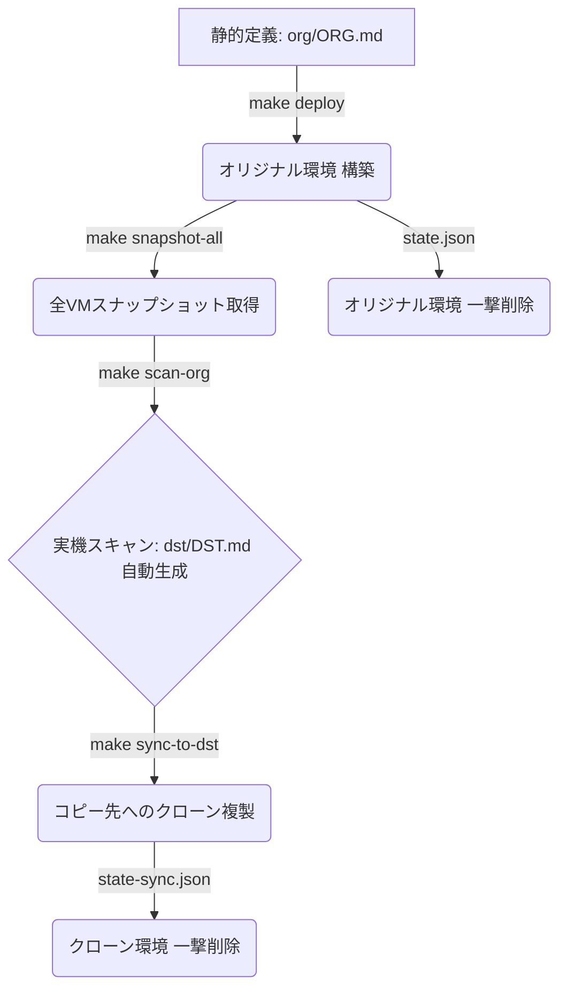

# GCP 共有VPC・プライベートVM環境 高速並列デプロイ & 同期クローン同期ツール

本リポジトリは、GCP上の共有VPC（Shared VPC）、インターネット接続ゲートウェイ（Cloud NAT）、セキュアアクセス（IAP SSH Firewall）、および Debian & Ubuntu プライベートVM 11台からなる大規模なインフラ環境を、**超高速（並列）に自動デプロイ、べき等クリーンアップ、実機動的スキャン、およびスナップショットからの完全同期クローン（環境複製）**を行うための運用自動化ツールを提供します。

---

## 前提条件と環境セットアップ

コマンドを実行する前に、以下のローカルセットアップを完了させてください。

### 1. ツール要件
- **Python 3.12以上**
- **`uv`** (Pythonパッケージ管理・仮想環境ツール): インストールされていない場合は、以下のコマンドでインストールしてください。
  ```bash
  curl -sSf https://rye.astral.sh/get | bash  # または pipx install uv
  ```

### 2. GCP 認証の実行
デプロイやスキャンを実行する端末で、GCPへのアクセス権限を設定します。
```bash
gcloud auth login
gcloud auth application-default login
```

---

## 💡 インフラ運用シナリオ

本ツールは、以下のインフラ運用シナリオの順番に沿って使用します。



---

### シナリオ 1: オリジナル（コピー元）環境の構築とバックアップ

まずは、コピー元となる正本（オリジナル）環境を構築し、バックアップ（スナップショット）を取得するシナリオです。

#### Step 1.1: 静的構成定義ファイル (`org/ORG.md`) の用意
コピー元の初期構成は `org/ORG.md` に定義されています。サブネットのIP範囲、プロジェクトID、VMのスペックが記載されています。

#### Step 1.2: 構築予定のドライラン確認 (`make plan`)
実際にデプロイされる予定の `gcloud` コマンド群および並列実行ステージの計画を目視で確認します。
```bash
make plan
```

#### Step 1.3: 超高速・並列デプロイの実行 (`make deploy`)
VPC作成、サブネット作成、NATゲートウェイ構築、IAP SSHファイアウォール配置、および **VM 11台への Nginx 自動インストールと設定** を、マルチスレッド並列で瞬時に一括構築します。
```bash
make deploy ARGS="-y"
```
> ℹ️ **自動構成されるWebサーバー仕様**
> 各VMの起動時、Nginxが自動セットアップされ、80番ポートの `/`（プレーンテキストで自身のホスト名とIPを返す）および `/json`（JSON形式で返す）エンドポイントが自動デプロイされます。

#### Step 1.4: 稼働中VMの一括スナップショット取得 (`make snapshot-all`)
環境が正常稼働したら、複製（コピー）用のバックアップとして、**稼働中VM 11台のブートディスクスナップショットを一斉に並列で取得**します。
```bash
make snapshot-all ARGS="-y"
```
- スナップショット名は、対象の **「マシン名と同一」** として作成されます。
- このバックアップスナップショットは、後述のクリーンアップを実行しても自動削除されず、安全に保護されます。

---

### シナリオ 2: 環境の複製（スキャン ➔ クローン同期コピー）

取得したバックアップスナップショットを利用し、新しい別のコピー先（Destination）プロジェクト群に、データごと環境を完全クローンするシナリオです。

#### 必要な情報（事前準備）
複製を実行する前に、以下の「プロジェクトIDマッピング情報」を整理してください。
- **コピー元プロジェクトID**: Host (`<SRC_HOST_PROJECT_ID>`), Service 1, Service 3

#### 準備: コピー先プロジェクトIDを環境変数としてエクスポートする
実機スキャン完了後、コピー先となる新しいプロジェクトID群を環境変数（シェル変数）として定義します。これにより、以降のコマンドをマッピング文字列を編集することなくコピペで実行できます。

```bash
# コピー先のGCPプロジェクトIDをそれぞれ設定します
export COPY_HOST_PROJECT_ID="your-destination-host-project-id"      # コピー先ホスト
export COPY_SVC1_PROJECT_ID="your-destination-service1-project-id"  # コピー先サービス1 (Debian)
export COPY_SVC3_PROJECT_ID="your-destination-service3-project-id"  # コピー先サービス3 (Ubuntu)
```

#### Step 2.1: オリジナル実機環境の自動スキャン・分析 (`make scan-org`)
静的定義ファイルに頼らず、現在実際にGCP上で稼働しているオリジナルインフラの実態を動的にディスカバー（探索）し、コピー先の設計図となる `dst/DST.md` を自動生成します。
```bash
make scan-org
```
- **高度なOS自動識別**: VMのディスクライセンス情報を解析し、`Debian 12` と `Ubuntu 22.04` のOS構成を100%正確に判定して設計図に落とし込みます。
- **無関係なリソースの排除**: 手動で作成された定義外のVM（`instance-1` 等）は自動的に検知してスキップし、ツール管理対象のみをクリーンに抽出します。

#### Step 2.2: コピー先プロジェクトのAPI事前自動有効化 (`make prepare-dst`)
コピー先でインフラ構築を走らせる前に、デプロイに必要な最小限のAPI（Compute Engine, Cloud DNS）を一撃で並列有効化し、構築エラーを完全に防止します。
```bash
make prepare-dst ARGS="--project-map <SRC_HOST_PROJECT_ID>=$COPY_HOST_PROJECT_ID,<SRC_SERVICE_PROJECT_ID_1>=$COPY_SVC1_PROJECT_ID,<SRC_SERVICE_PROJECT_ID_3>=$COPY_SVC3_PROJECT_ID -y"
```

#### Step 2.3: 同期クローン（復元）のドライラン確認
プロジェクトIDの置換およびスナップショットからクローン復元される実行計画を目視確認します。
```bash
make sync-to-dst ARGS="--project-map <SRC_HOST_PROJECT_ID>=$COPY_HOST_PROJECT_ID,<SRC_SERVICE_PROJECT_ID_1>=$COPY_SVC1_PROJECT_ID,<SRC_SERVICE_PROJECT_ID_3>=$COPY_SVC3_PROJECT_ID --dry-run"
```

#### Step 2.4: スナップショットからの完全同期複製の実行 (`make sync-to-dst`)
クローンデプロイを実行します。
```bash
make sync-to-dst ARGS="--project-map <SRC_HOST_PROJECT_ID>=$COPY_HOST_PROJECT_ID,<SRC_SERVICE_PROJECT_ID_1>=$COPY_SVC1_PROJECT_ID,<SRC_SERVICE_PROJECT_ID_3>=$COPY_SVC3_PROJECT_ID -y"
```
> 🚀 **完全同期クローンのメカニズム**
> 1. 新しいコピー先ホストプロジェクトに、共有VPC、サブネット、NAT、IAP SSH FW等のネットワークインフラを自動構築。
> 2. オリジナル環境のディスクスナップショットから、コピー先サービスプロジェクトにディスクを**並列一斉復元（クローンディスク作成）**。
> 3. 復元したブートディスクを指定し、VMインスタンスを新規起動（**OSの状態やデータ、インストール済みのNginx設定ごと完全復元起動**）。

---

### シナリオ 3: 不要になった環境のクリーンアップ（一撃削除）

検証やクローン同期が終わり、環境を安全かつ完全に撤去するシナリオです。
本ツールは **Terraformライクなステート管理** を導入しており、「自分がデプロイしたリソース」だけを `state.json` の実績データを元に追跡・削除するため、**同じプロジェクト内にある他人のリソース（`instance-1` 等）には一切干渉せず、安全に撤去可能**です。

#### オリジナル環境の削除
```bash
make destroy
```
- ホストプロジェクトIDを入力する強力な確認プロンプトが表示されます。

#### クローン（コピー先）環境の削除
クローン時に生成された `state-sync.json` を指定して、コピー先リソースを一撃で撤去します。
```bash
make destroy ARGS="--config dst/DST.md --state-file state-sync.json"
```

---

## 🛠️ その他の便利コマンド

### 単体テストの実行
ツール内の主要ロジック（パーサー、置換マッピング、スナップショット生成、VPC作成コマンド等の整合性）をすべてローカルでテストします（GCP実機接続は不要）。
```bash
make test
```
