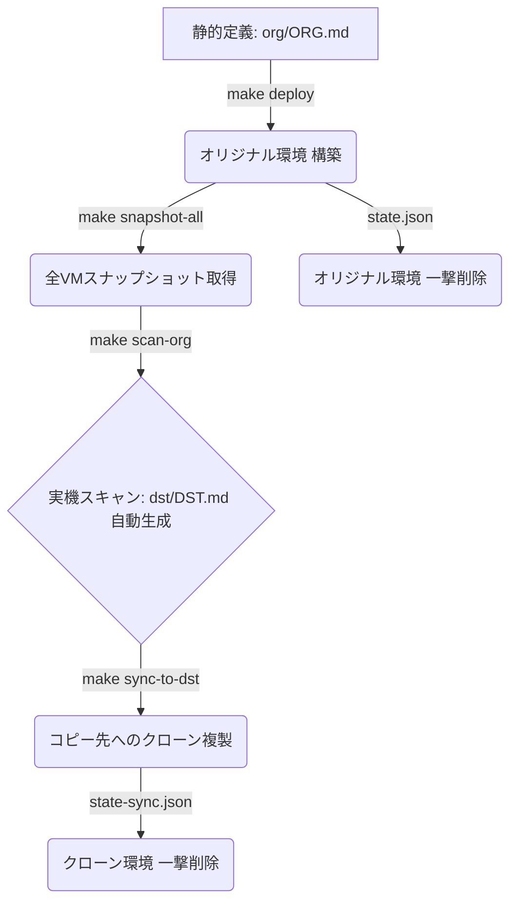

# GCP 共有VPC・プライベートVM環境 高速並列デプロイ & 同期クローン同期ツール

本リポジトリは、GCP上の共有VPC（Shared VPC）、インターネット接続ゲートウェイ（Cloud NAT）、セキュアアクセス（IAP SSH Firewall）、および Debian & Ubuntu プライベートVM 11台からなる大規模なインフラ環境を、**超高速（並列）に自動デプロイ、べき等クリーンアップ、実機動的スキャン、およびスナップショットからの完全同期クローン（環境複製）**を行うための運用自動化ツールを提供します。

---

## 前提条件と環境セットアップ

コマンドを実行する前に、以下のローカルセットアップを完了させてください。

### 1. ツール要件
- **Python 3.12以上**
- **`uv`** (Pythonパッケージ管理・仮想環境ツール): インストールされていない場合は、以下のコマンドでインストールしてください。
  ```bash
  curl -sSf https://rye.astral.sh/get | bash  # または pipx install uv
  ```

### 2. GCP 認証と安全なアクセス設定 (推奨)
本ツールはセキュリティ向上のため、サービスアカウントキー (JSONファイル) は使用せず、**サービスアカウントの権限借用 (Impersonation)** を使用します。

1. 実行ユーザーで gcloud にログインします。
   ```bash
   gcloud auth login
   ```
2. 実行ユーザーに対し、移行用サービスアカウントに対する「サービス アカウント トークン作成者 (`roles/iam.serviceAccountTokenCreator`)」ロールが付与されていることを確認してください。

### 3. 設定ファイル (config.yaml) の準備
移行の動作設定やプロジェクトのマッピングは `dst/config.yaml` で管理します。
テンプレートからファイルをコピーし、お使いの環境に合わせて編集してください。

```bash
cp dst/config.yaml.template dst/config.yaml
```

設定ファイルには以下を定義します：
- コピー元とコピー先のプロジェクトIDマッピング
- 各プロジェクト操作用の借用対象サービスアカウント (コピー元は読み取り専用推奨)
- リソースのリネームルール (GCSバケット等)
- 各ステップの有効/無効および個別設定 (スナップショットの期限など)
- **外部コマンドの実行ログ詳細度 (`verbose_logging`)**

---

## 💡 インフラ運用シナリオ

本ツールは、以下のインフラ運用シナリオの順番に沿って使用します。



---

### シナリオ 1: オリジナル（コピー元）環境の構築とバックアップ

まずは、コピー元となる正本（オリジナル）環境を構築し、バックアップ（スナップショット）を取得するシナリオです。

#### Step 1.1: 静的構成定義ファイル (`org/ORG.md`) の用意
コピー元の初期構成は `org/ORG.md` に定義されています。サブネットのIP範囲、プロジェクトID、VMのスペックが記載されています。

#### Step 1.2: 構築予定のドライラン確認 (`make plan`)
実際にデプロイされる予定の `gcloud` コマンド群および並列実行ステージの計画を目視で確認します。
```bash
make plan
```

#### Step 1.3: 超高速・並列デプロイの実行 (`make deploy`)
VPC作成、サブネット作成、NATゲートウェイ構築、IAP SSHファイアウォール配置、および **VM 11台への Nginx 自動インストールと設定** を、マルチスレッド並列で瞬時に一括構築します。
```bash
make deploy ARGS="-y"
```
> ℹ️ **自動構成されるWebサーバー仕様**
> 各VMの起動時、Nginxが自動セットアップされ、80番ポートの `/`（プレーンテキストで自身のホスト名とIPを返す）および `/json`（JSON形式で返す）エンドポイントが自動デプロイされます。

#### Step 1.4: 稼働中VMの一括スナップショット取得 (`make snapshot-all`)
環境が正常稼働したら、複製（コピー）用のバックアップとして、**稼働中VM 11台のブートディスクスナップショットを一斉に並列で取得**します。
```bash
make snapshot-all ARGS="-y"
```
- スナップショット名は、対象の **「マシン名と同一」** として作成されます。
- このバックアップスナップショットは、後述のクリーンアップを実行しても自動削除されず、安全に保護されます。

---

### シナリオ 2: 環境の複製（スキャン ➔ クローン同期コピー）

取得したバックアップスナップショットを利用し、新しい別のコピー先（Destination）プロジェクト群に、データごと環境を完全クローンするシナリオです。

#### 準備: 設定ファイル (`dst/config.yaml`) の作成と編集
移行作業を開始する前に、`dst/config.yaml.template` から `dst/config.yaml` を作成し、コピー元とコピー先のプロジェクトIDマッピング、権限借用するサービスアカウント、リネームルール等を適切に設定してください。

```bash
cp dst/config.yaml.template dst/config.yaml
```

#### Step 2.1: 実行計画のドライラン確認 (`make plan`)
実際に移行処理を走らせる前に、必ずドライランを実行して実行計画を確認してください。
生の `gcloud` や `terraform` コマンド文字列と、人間用の動作補足メッセージが詳細ログとして出力されます。

```bash
make plan
```

> 🔍 **ドライランで検証・計画される項目**:
> 1. **CAI現状確認 (`cai_scan`)**: コピー元の有効なリソース一覧の探索。
> 2. **GCEスナップショット検証 (`gce_snapshot`)**: 各VMに30日以内の有効なスナップショットが存在するかチェック（存在しない場合はエラー出力）。
> 3. **Terraformコード生成 (`bulk_export`)**: Originalリソースを HCL としてエクスポートする計画。
> 4. **インフラ構築適用 (`terraform_apply`)**: コピー先でのデプロイ計画。
> 5. **VMデータ復元 (`gce_restore`)**: スナップショットから復元したディスクの紐付け計画。
> 6. **データ移行 (`data_sync`)**: GCSバケット（リネームルール適用後）の同期計画。

#### Step 2.2: 移行クローンの本番実行 (`make run`)
ドライラン計画に問題がなければ、本番実行を行います。
※安全のため、`config.yaml` でコピー元には読み取り専用SAを、コピー先には編集者以上のSAを指定していることを再度ご確認ください。

```bash
make run
```

> 🚀 **完全同期クローンのメカニズム**
> 1. 新しいコピー先ホストプロジェクトに、共有VPC、サブネット、NAT、IAP SSH FW等のネットワークインフラを自動構築。
> 2. オリジナル環境の有効なディスクスナップショット（30日以内）から、コピー先サービスプロジェクトにディスクを**並列一斉復元（クローンディスク作成）**。
> 3. 復元したブートディスクを指定し、VMインスタンスを新規起動（**OSの状態やデータ、インストール済みのNginx設定ごと完全復元起動**）。
> 4. `config.yaml` のリネームルールに基づき、GCSバケット等のグローバルユニークなリソースを衝突を避けて再作成し、データを高速同期。

---

## 🔍 外部コマンドの可視化とログ仕様

本ツールは、実行中の各操作の透明性を高め、ドライラン時の検証やエラー時のデバッグを容易にするため、強力な詳細ログ機能を備えています。

### 1. ログの可視性
- **生の外部コマンド出力**: `gcloud`, `terraform`, `gsutil` などのコマンドを呼び出す際、実際に実行される**生のコマンド文字列（引数を含む）**をログに記録します。
- **日本語による動作補足説明**: コマンドライン出力の前に、「今何の目的でその操作を行っているか」の解説が必ず出力されます。
  * *出力例*:
    ```text
    [data_sync] [GCSデータ同期] コピー元 "org-bucket" から コピー先 "org-bucket-dst-0602" へデータを同期しています...
    -> gsutil -m rsync -r gs://org-bucket gs://org-bucket-dst-0602
    ```

### 2. 並列実行時のログ追跡
並列処理（`parallel_jobs` > 1）実行時にログが乱雑になるのを防ぐため、すべてのログ行の先頭に `[ステップ名] [スレッド/対象オブジェクト名]` のタグが自動付与され、特定VMや特定ステップのログのみを `grep` 等で容易に抽出できます。

### 3. 設定方法
`dst/config.yaml` の `global.verbose_logging` でこの詳細出力のON/OFFを制御できます。
```yaml
global:
  verbose_logging: true  # デフォルト: true (詳細ログを有効化)
```

---

## 🛠️ その他の便利コマンド

### 単体テストの実行
移行ツール内の主要ロジック（HCL置換エンジンなどのpytest）をすべてローカルでテストします。
```bash
make test
```
