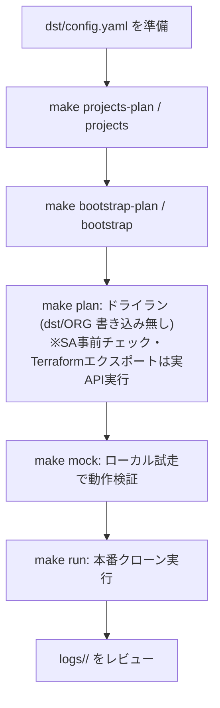

# GCP プロジェクト まるごとコピー ツール (Terraform / IaC ベース)

既存の GCP マルチプロジェクト環境（**Original / コピー元**）を、構成とデータを保持したまま
新しい GCP プロジェクト群（**Destination / コピー先**）へ **まるごとクローン** する運用自動化ツールです。

`dst/config.yaml` の定義に基づき、CAI スキャン → スナップショット検証 → Terraform エクスポート/適用 →
GCE 復元 → データ同期（GCS/BigQuery）までを一連で自動実行します。

> 🔐 **このツールは Original（ORG）プロジェクトに一切書き込みを行いません。**
> コード側で「src 操作は read-only のみ・借用 SA 必須・書き込み動詞は実行前に拒否」を強制しています。
> 詳細は後述の [ORG プロジェクト保護](#-org-プロジェクト保護) を参照してください。

---

## 前提条件と環境セットアップ

### 1. ツール要件
- **Python 3.12 以上**
- **`uv`**（Python パッケージ管理・仮想環境ツール）
  ```bash
  curl -sSf https://rye.astral.sh/get | bash   # または pipx install uv
  ```
- **`terraform`**（**必須**: Step 4 のインフラ再現で使用）
  ```bash
  # 例: 公式バイナリを導入（Debian/Ubuntu）
  terraform version   # 確認（バージョンが出れば OK）
  # 未導入の場合: https://developer.hashicorp.com/terraform/install
  ```
- **`gcloud` / `bq`**（GCP CLI）

> ✅ **前提チェック（fail-fast）**: `make plan` / `make run` は開始時に、有効化された
> ステップが必要とする CLI（`gcloud` / `terraform` / `bq` / `config-connector`）の存在を確認します。
> 不足しているとステップ途中で `not found` になる前に**即停止**します（Mock モードはスキップ）。
>
> ✅ **SA 事前チェック（fail-fast）**: CLI 確認に続けて、`config.yaml` の借用 SA を実行前に検証します。
> ① `gcloud auth print-access-token` でアクセストークン発行を試み、**SA の実在**と実行ユーザーの
> **借用権限（`roles/iam.serviceAccountTokenCreator`）** を確認、② `gcloud projects test-iam-permissions`
> で対象プロジェクトの**代表権限**（src=読取 / dst=書込）の有無を確認します。借用不可・権限不足を
> 検出すると全件を列挙して**即停止**します（Mock モードはスキップ）。dry-run（`make plan`）でも実行され、
> dst SA の不備もこの段階で検出できます。
> ⚠️ 検証する権限は有効ステップに対応する**代表値**であり、全リソース種を網羅するものではありません。
- **Config Connector**（**必須**）: Step 3 の Terraform エクスポート
  (`gcloud beta resource-config bulk-export --resource-format=terraform`) が依存する gcloud コンポーネント。
  未インストールだと `make plan` / `make run` は前提チェックで**即停止**します（Mock モードを除く）。
  ```bash
  gcloud components install config-connector   # インストール
  which config-connector                       # 確認（パスが返れば OK）
  ```
  > ℹ️ Config Connector は `bulk_export` ステップが有効な場合のみ必須です。`make mock` では実コマンドを叩かないためチェックをスキップします。

### 2. GCP 認証と安全なアクセス設定（Impersonation）
セキュリティ向上のため、サービスアカウントキー (JSON) は使用せず、
**サービスアカウントの権限借用 (Impersonation)** を使用します。

1. 実行ユーザーで gcloud にログイン
   ```bash
   gcloud auth login
   ```
2. 実行ユーザーに対し、移行用サービスアカウントへの
   「サービス アカウント トークン作成者 (`roles/iam.serviceAccountTokenCreator`)」ロールが
   付与されていることを確認してください。
3. **コピー元 (src) には読み取り専用 (Viewer 等)**、**コピー先 (dst) には編集権限 (Editor 等)** の
   SA を指定します（後述の `config.yaml`）。

> 🧰 **コピー元 (src) の借用 SA を一括セットアップ**
> `config.yaml` の `src_impersonate_service_account` に指定した読み取り専用 SA を、各 src プロジェクトに
> 作成・権限付与するヘルパースクリプトを用意しています。**この処理だけは ORG (src) への書き込みを伴う**ため、
> `sync_env.py` の ORG 保護とは意図的に分離した手動セットアップ用です（既定は dry-run）。
> ```bash
> scripts/bootstrap_src_sa.sh                          # dry-run（実行されるコマンドの表示のみ）
> scripts/bootstrap_src_sa.sh --apply                  # 実際に SA 作成・ロール付与
> scripts/bootstrap_src_sa.sh --apply --impersonator user:foo@example.com
> ```
> 付与内容（各 src プロジェクトごと）: `roles/viewer`（compute / GCS / BigQuery の read）、
> `roles/cloudasset.viewer`（CAI スキャン・bulk-export 用）、および実行アカウントへの
> `roles/iam.serviceAccountTokenCreator`（= SA 借用権限）。

> 🧰 **コピー先 (dst) 側の一括ブートストラップ（`make bootstrap-plan` / `make bootstrap`）**
> 新しい dst プロジェクト群を用意した直後は、(a) dst SA、(b) dst SA に対する src 読取権限、
> (c) Shared VPC 構成 の 3 点が未整備で `make plan` の SA 事前チェックが落ちます。これらを
> まとめてセットアップする Make ターゲットを用意しています（`projects*` と同じく裸 = 実適用 / `-plan` = dry-run）。
> ```bash
> make bootstrap-plan     # 3 つを順に dry-run（実行されるコマンドの表示のみ）
> make bootstrap          # 3 つを --apply で実行（dst と src(ORG) に IAM/構成を書き込みます）
> # 個別に流したい場合（裸 = 実適用 / -plan = dry-run）
> make bootstrap-dst-sa                 # dst SA 作成 + editor/storage.admin/bigquery.admin + tokenCreator
> make bootstrap-cross-project          # dst SA に src の migrationSrcReader + bigquery.dataViewer
> make bootstrap-shared-vpc             # host を Shared VPC 化、svc をアタッチ、networkUser 付与
> ```
> 中身（呼び出されるスクリプト）:
> - `scripts/bootstrap_dst_sa.sh` … dst SA を各 dst プロジェクトに作成し、`roles/editor`・`roles/storage.admin`・`roles/bigquery.admin` と、実行アカウントへの `roles/iam.serviceAccountTokenCreator` を付与。
> - `scripts/bootstrap_cross_project.sh` … 各 src プロジェクトに read-only カスタムロール `migrationSrcReader` を作成し、対応する dst SA に付与（さらに `roles/bigquery.dataViewer`）。**src(ORG) への read-only IAM 付与**を伴うため、`sync_env.py` の ORG 保護から意図的に分離されています。
> - `scripts/bootstrap_shared_vpc.sh` … dst host を Shared VPC ホストにし、dst svc プロジェクトをアタッチ、各 svc の cloudservices/compute SA と svc 借用 SA に `roles/compute.networkUser` を付与。
>
> SA 事前チェックで dst SA の借用に失敗した場合、`make plan` / `make run` の停止メッセージに
> 上記コマンドが自動表示されます。

### 3. 設定ファイル (config.yaml) の準備
テンプレートからコピーして、環境に合わせて編集します。

```bash
cp dst/config.yaml.template dst/config.yaml
```

`dst/config.yaml` で定義する主な項目:
- **`project_mapping`**: コピー元 (src) とコピー先 (dst) のプロジェクト ID、および借用 SA
  (`src_impersonate_service_account` / `dst_impersonate_service_account`)。`host_project` と `service_projects` を定義します。
- **`rename_rules`**: GCS バケット等のグローバルユニークなリソースのリネーム規則。
  `gcs.value` に固定文字列を指定するか、`"auto"` にすると日付ベースの一意 suffix
  （例: `-dst-MMDDHHMM`）を自動生成します。生成値は `terraform/.gcs_rename_value` に
  永続化され、`make plan` / `make run` / `skip_on_run` 間で同じ値が再利用されます
  （別名で作り直す場合はこのファイルを削除）。
- **`steps`**: 各ステップ (1〜6) の有効/無効と個別設定（スナップショット期限など）。
  `bulk_export.skip_on_run: true` にすると本番実行 (`make run`) では export/customize を
  スキップし、`make plan` で生成済みの `terraform/active/` を再利用して高速化します
  （`make plan` 自体は常に最新を取り直します）。
- **`global`**: `dry_run` / `verbose_logging` / `parallel_jobs` / `log_dir` / `org_log_file` / `dst_log_file`。
- **`bootstrap`**: コピー先プロジェクトを新規作成する場合の組織 ID / フォルダ ID（任意） / 請求先アカウント。

---

## 🚀 使い方（Makefile）

| コマンド | 説明 |
| :--- | :--- |
| `make setup` | uv 仮想環境の同期・セットアップ |
| `make projects-plan` | コピー先プロジェクト作成の **ドライラン** |
| `make projects` | コピー先プロジェクトを実際に作成（請求紐付け + API 有効化） |
| `make delete-projects-plan PATTERN=xxx` | `dst/config.yaml` の dst プロジェクトのうち `project_id` に `xxx` を含むものを **一覧表示のみ**（削除なし） |
| `make delete-projects PATTERN=xxx` | 同上を **削除**（6 桁ランダムコードを端末に入力しないと進まない安全策つき。lien も自動解除） |
| `make bootstrap-plan` | dst SA / src 読取権限 / Shared VPC を順に **ドライラン** で表示 |
| `make bootstrap` | 上記 3 つを `--apply` で実行（dst と src(ORG) に IAM/構成を書き込み） |
| `make bootstrap-dst-sa` | dst SA 作成 + ロール付与のみ実行（dry-run は `-plan` 付き） |
| `make bootstrap-cross-project` | dst SA → src の読取権限のみ実行（dry-run は `-plan` 付き） |
| `make bootstrap-shared-vpc` | Shared VPC 化のみ実行（dry-run は `-plan` 付き） |
| `make plan` | 移行処理の **ドライラン**（dst / ORG への書き込みは無し）。ただし表示のみではなく、**SA 事前チェック（借用トークン発行＋ testIamPermissions の実 API 呼び出し）** と **Terraform エクスポート（`gcloud beta resource-config bulk-export` を実際に実行し `terraform/active/` を生成）** は本当に走る |
| `make mock` | **Mock モード** でローカル試走（GCP 未接続でも動作） |
| `make run` | 移行処理の **本番実行**（dst への書き込みを伴う） |
| `make test` | 単体テスト (pytest) を実行 |

各コマンドには `ARGS="..."` で追加の引数を渡せます（例: `make plan ARGS="--config path/to/config.yaml"`）。

> 🗑️ **`make delete-projects` の安全策**
> - **copy-all-env が作成したものしか消さない**: 削除対象は `dst/config.yaml` の `project_mapping.host_project.dst` と `project_mapping.service_projects[].dst` に登録されている dst プロジェクトに限定。config に無い無関係なプロジェクトは仕様上候補に上がりません。
> - `PATTERN` 必須・3 文字未満は拒否。上記の dst 一覧をさらに project_id 部分一致で絞り込み、削除前にテーブル形式で一覧表示します（`# / kind(host|svc) / project_id / name / state / lien 数 / src project`）。
> - 6 桁のランダムコードを端末に表示し、**そのコードを打鍵しない限り削除は実行されません**。
> - lien (`compute.googleapis.com/projects-delete-prevented` 等) が付いていれば `gcloud alpha resource-manager liens delete` で先に解除してから `gcloud projects delete --quiet` を呼びます。
> - `lifecycleState != ACTIVE` のものや、describe で確認できないもの（存在しない / 権限不足）は自動でスキップし、スキップ理由を一覧出力します。
> - 既定は `--dry-run`（make ターゲット側で `--no-dry-run` を付与）。並列度は `dst/config.yaml` の `global.parallel_jobs`（既定 8）に従います。

---

## 💡 推奨運用フロー



### Step 0: コピー先プロジェクトの準備
```bash
make projects-plan   # 何が作成されるか確認
make projects        # 実際に作成（org_id / billing_account が必要）
```

### Step 0.5: SA / IAM / Shared VPC のブートストラップ
新規 dst プロジェクトでは、続けて以下を実行して SA・読取権限・Shared VPC を整えます。
```bash
make bootstrap-plan    # 3 スクリプトを順に dry-run（内容を確認）
make bootstrap         # 確認できたら --apply で実行
```

### Step 1: 実行計画のドライラン確認
本番実行の前に、必ずドライランで実行計画を確認します。
**dst / ORG への書き込みは発生しません**（src 操作は read-only のみ）。

> ⚠️ **`make plan` は「表示のみ」ではありません。** dst/ORG を変更しないという意味でのドライランですが、
> 計画を立てるために以下は **実際に外部コマンド / API を実行** します（src は read-only の範囲）:
> - **SA 事前チェック**: 借用 SA のアクセストークン発行（impersonation）と `testIamPermissions` を **実 API で**叩いて検証します（SA の*作成*はしません。作成は `make bootstrap`）。
> - **Terraform エクスポート** (`bulk_export`): `gcloud beta resource-config bulk-export` を**実際に実行**し、ローカルに `terraform/active/` を生成します（src からの読み取りのみ。`make plan` は常に最新を取り直します）。

```bash
make plan
```

> 🔍 **ドライランで計画・検証される項目**
> 1. **CAI 現状確認** (`cai_scan`): コピー元の有効なリソース一覧を探索（実 API 読み取り）。
> 2. **GCE スナップショット検証** (`gce_snapshot`): 各 VM に期限内（既定 30 日）の有効なスナップショットがあるか確認（実 API 読み取り）。なければエラー。
> 3. **Terraform コード生成** (`bulk_export`): Original リソースを HCL として **実際にエクスポート**し、プロジェクト ID 置換・GCS バケットのリネーム・同一プロジェクト内 network 参照の `self_link` 化・`boot_disk.source` 行の削除を実施。
> 4. **インフラ再現** (`terraform_apply`): `terraform plan -out=tfplan` を生成（本番時のみ apply）。
> 5. **VM データ復元** (`gce_restore`): スナップショットから復元したディスクの差し替え計画。
> 6. **データ移行** (`data_sync`): GCS バケット（リネーム後）・BigQuery（location 継承）の同期計画。

### Step 2: Mock モードでのローカル試走（任意）
実際の GCP 環境や有効な SA がなくても、`make run` 全体のフローをエラーなく試走できます。
```bash
make mock
```
- Mock モードでは外部コマンドを実行せず、ダミーデータで一連の流れをシミュレートします。
- **未対応コマンドは安全のため即停止 (fail-closed)** します。

### Step 3: 本番実行
ドライラン計画に問題がなければ本番実行します。
```bash
make run
```

> 🚀 **クローンのメカニズム**
> 1. コピー先ホストプロジェクトに、Terraform で VPC・サブネット・NAT・FW 等のインフラを再現。
> 2. Original の有効なスナップショット（期限内）から、コピー先にディスクを復元。
> 3. 復元したブートディスクを VM に差し替えて起動（OS 状態・データごと完全復元）。
> 4. `rename_rules` に基づき GCS バケット等を衝突回避してリネームし、データを同期。
> 5. BigQuery データセットは **src の location を継承** して作成（クロスリージョン失敗を回避）。

> ♻️ **Terraform 適用の冪等性**（再実行しても 409/404 で落ちないための仕組み）
> - dst プロジェクトが前回と変わった場合、stale な `terraform.tfstate` を破棄して import からやり直します（`active/<src>/.dst_project` マーカーで判定）。
> - `google_storage_bucket` はリネーム後の実名で import し、作成済みバケットを adopt して再 apply を冪等化。
> - 同一プロジェクト内の network URL を `google_compute_network.<label>.self_link` 参照へ書き換え、firewall/subnetwork が network より先に作られて 404 になるのを防止。
> - VM/disk は Step 4 ではなく Step 5 (`gce_restore`) 側で管理し、`make run` の失敗を抑制。

---

## 🔐 ORG プロジェクト保護

このツールは「コピー元 (ORG) には絶対に変更を加えない」ことを **運用ルールではなくコードで強制** します。

| 仕組み | 内容 |
| :--- | :--- |
| **side による操作分類** | すべての外部コマンドは `side="src" / "dst" / "local"` のいずれかで実行されます。 |
| **src は read-only 強制** | `side="src"` のコマンドに書き込み動詞（`create / delete / update / stop / start / attach / detach / mk / cp / rsync / apply` 等）が含まれていたら、**実行前に拒否**して停止します。 |
| **借用 SA 必須** | `side="src"` で `impersonate_sa` が未指定の場合、実行ユーザー権限で ORG を叩くのを防ぐため即停止します。 |
| **設定バリデーション** | `src == dst`、dst が他の src と衝突、借用 SA 未指定、`service_projects` が空 等を検出すると、処理を何もせずに停止します。 |
| **SA 事前チェック** | 実行前に借用 SA の**実在・借用可否・代表権限**（src=読取 / dst=書込）を検証し、不足を検出したら全件列挙して停止します（`make plan` でも実行、Mock はスキップ）。 |
| **Mock は fail-closed** | Mock モードで未対応のコマンドが来たら、本物実行に進ませず即停止します。 |

これらにより、`config.yaml` の設定ミスやヒューマンエラーがあっても ORG への書き込みが発生しません。

---

## 🔍 ログ仕様（レビューしやすさ重視）

実行のたびに **`logs/<タイムスタンプ>/` ディレクトリ** が新規作成され、その中に
コピー元操作ログ `org.log` とコピー先操作ログ `dst.log` が分離して記録されます（追記による履歴累積はしません）。

- **日本語で記録**: 各操作の「実行内容」を日本語の補足説明付きで出力。
- **ステップ単位でグループ化**: `━━━━` バーで `ステップ N: タイトル (対象 X 件)` を区切り表示。
- **アクションの記号化**: `✓ スキップ / + 作成 / − 削除 / ✗ 失敗` で一目で判別。
- **スレッドタグ**: 並列実行時、各ログ行に `[main]` / `[cai-scan_0]` 等のタグが自動付与され、`grep` で追跡可能。
- **末尾サマリ**: 実行時間 / 読取成功 / 書込成功 / スキップ / 失敗 / Mock 実行 / ログパスを出力。
- **詳細ログ**: `verbose_logging: true` のとき、生の `gcloud` / `terraform` コマンド文字列と STDOUT を DEBUG レベルでファイルに記録（コンソールは INFO のみ）。

```bash
# 直近の実行ログを確認
ls -t logs/ | head -1
tail -f logs/$(ls -t logs/ | head -1)/dst.log
```

---

## 📦 VMDK → GCE インポート（`vmware/`）

VMware からエクスポートした VMDK を GCS 経由で **Migrate to VMs API**（`gcloud migration vms image-imports create`）でカスタムイメージ化し、
指定した構成の GCE インスタンスを作成するためのワークフローです。本体の `dst/` パイプラインとは独立しています。

設定ファイル: [`vmware/config.yaml`](./vmware/config.yaml)（テンプレート: [`vmware/config.yaml.template`](./vmware/config.yaml.template)）

| セクション | 用途 |
| :--- | :--- |
| `global` | 出力先 project / region / zone / dry_run / ログ設定 |
| `source.disks[]` | import 対象 VMDK の GCS URI（`boot: true` を 1 本、`boot: false` をデータディスクとして複数指定可） |
| `image_import` | image 名 prefix、ライセンスタイプ（省略可）、Migration host/target project 分離構成（省略可） |
| `instance` | machine_type、boot disk 設定、追加ディスク、service account、labels、tags、metadata |
| `network` | VPC / subnetwork（Shared VPC は `host_project` 指定）、内部 IP（予約 address 名 or 直接 IP）、外部 IP 有無・tier |

処理ステップ（`setup → import → start`）:

1. **setup**: 必要 API の有効化（compute / storage / vmmigration / iam）、Migrate to VMs の TargetProject 登録、vmmigration SA への source bucket 権限付与（`roles/storage.objectViewer`）、内部 IP / 外部 static IP の予約。
2. **import**: `source.disks[]` の各 VMDK を `gcloud migration vms image-imports create` でカスタムイメージ化（**非同期**）。boot disk は OS イメージとして、`boot: false` は `--skip-os-adaptation` 付きでデータディスクとして import。完了確認は `gcloud migration vms image-imports describe` でポーリング。
3. **start**: boot image から `gcloud compute instances create` で GCE を作成（machine_type / SA / labels / tags / 内部 static IP / 外部 IP を config に従って設定）。データディスクがあれば対応イメージから `compute disks create` → `compute instances attach-disk`。

Makefile コマンド（`vmware/` 配下、またはルートから `make vmware-*`）:

| コマンド | 説明 |
| :--- | :--- |
| `make vmware-setup` | setup を dry_run 設定に従って実行 |
| `make vmware-setup-apply` | setup を `--apply`（必ず実行）で実行 |
| `make vmware-import` | VMDK → カスタムイメージ化（非同期投入） |
| `make vmware-import-apply` | 同上、`--apply` で実行 |
| `make vmware-start` | カスタムイメージから GCE インスタンス作成・起動 |
| `make vmware-start-apply` | 同上、`--apply` で実行 |
| `make vmware-all` | setup → import → start を順次（dry_run は config に従う） |
| `make vmware-all-apply` | 同上、`--apply` で全ステップ実行 |
| `make vmware-clean` | `vmware/logs/` を削除 |

> 設定ファイルを切り替える場合: `make vmware-setup-apply VMWARE_CONFIG=vmware/other.yaml`
>
> `image_import.target_project_host` / `target_project_name` は Migration host project と target project を分離する構成（省略時は `global.project_id` を使用）。

---

## 🛠️ その他

### 単体テストの実行
ORG 保護ロジック、HCL カスタマイズ（置換エンジン）、設定バリデーション等をローカルで検証します（GCP 実機接続は不要）。
```bash
make test
```

### 変更履歴
変更内容と理由は [`HISTORY.md`](./HISTORY.md) に日付の新しい順で記録しています。

### 仕様書
- [`SPEC.md`](./SPEC.md) / [`dst/SPEC.md`](./dst/SPEC.md): 詳細仕様。
- [`dst/PROCEDURE.md`](./dst/PROCEDURE.md): 推奨手順と要件。

---

## 📎 Appendix: コピー元 (ORG) 環境をゼロから構築する (`make org*`)

> 通常運用では **不要** です。本ツールの主目的は「既存コピー元 → 新コピー先のクローン」であり、
> コピー元は普通すでに存在しています。検証 / デモ用に「コピー元っぽい環境」を一から
> 用意したい場合だけ以下を使ってください。

`make org*` は `scripts/setup_org.sh` を呼び出し、[`org/ORG.md`](./org/ORG.md) に
記述された構成（プロジェクト / VPC / Subnet / Router / NAT / Shared VPC / VM /
初期スナップショット）を **冪等に**構築します。値の Single Source of Truth は
`org/ORG.md` で、スクリプトは [`scripts/parse_org_md.py`](./scripts/parse_org_md.py)
経由でマークダウン表をパースして読み取ります（IP・VM 名等はハードコードしません）。

### コマンド

| コマンド | 説明 |
| :--- | :--- |
| `make org-plan` | ドライラン（実行される `gcloud` コマンドの表示のみ） |
| `make org` | 実際に作成（`--apply` 相当。host / svc プロジェクトに書き込みます） |

### パラメータ (env)

| 変数 | 既定 | 用途 |
| :--- | :--- | :--- |
| `ORG_MD` | `org/ORG.md` | 構成ファイル（別パスでプレビューする時に上書き） |
| `PARALLEL_JOBS` | `8` | API enable / IP 予約 / VM 作成 / snapshot 作成の並列度上限。Compute Engine API の Quota（regional concurrent ops 500/project, snapshots 専用枠等）に余裕がある範囲で設定 |

### 構築されるリソース（ORG.md の表から生成）

1. Compute Engine API の有効化（host / svc1 / svc3）
2. host project に VPC / Subnet × 2 / Cloud Router / Cloud NAT
3. host を Shared VPC 化し、svc1 / svc3 をアタッチ
4. svc1 / svc3 で **内部固定 IP** を予約
5. svc1 に Debian VM、svc3 に Ubuntu VM をそれぞれ作成
6. 各 VM の **初期スナップショット** (`<vm>-init-snap`) を作成

各リソースは describe で存在確認し、既存ならスキップします（再実行安全）。

### startup-script の自動付与

`org/startup-scripts/{linux,windows}/` 配下の **実行可能ファイル** を
lexicographic 順に連結し、VM の `--metadata-from-file=startup-script=...`
（Windows は `windows-startup-script-ps1=...`）として登録します。
ディレクトリ / 実行可能ファイルが無ければ自動スキップ。

### 設定変更時

`org/ORG.md` の表（VM 名 / IP / マシンタイプ / サブネット等）を編集 →
`make org-plan` で差分確認 → `make org` で適用。スクリプト側のハードコードは無いので、
新 VM の追加・IP 変更は ORG.md を直すだけで反映されます。

### 前提

- `python3` が PATH にあること（ORG.md パースに使用。stdlib のみで動くので `uv` 不要）
- `gcloud` が PATH にあり、host / svc プロジェクトに対し Compute Admin / Compute Network Admin / Shared VPC Admin 相当の権限を持つアカウントで `gcloud auth login` 済みであること
- 3 つのプロジェクト (host / svc1 / svc3) が billing 紐付け済みで存在すること
