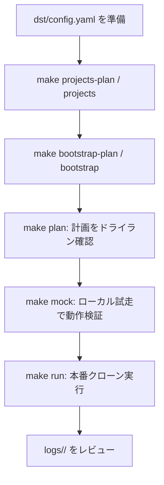
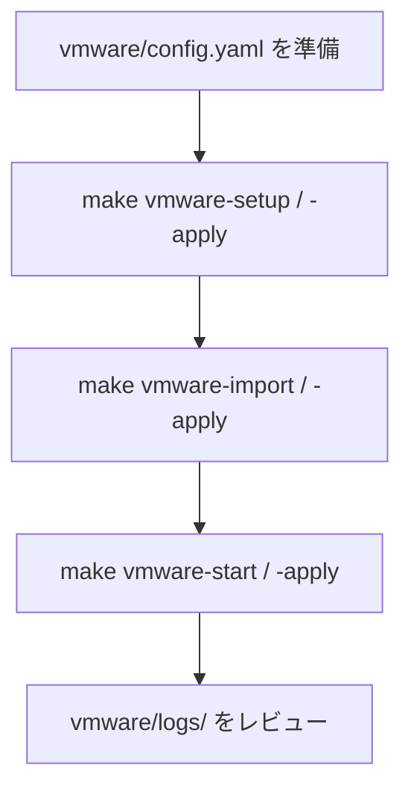

# GCP プロジェクト まるごとコピー ツール (Terraform / IaC ベース)

既存の GCP マルチプロジェクト環境（**Original / コピー元**）を、構成とデータを保持したまま
新しい GCP プロジェクト群（**Destination / コピー先**）へ **まるごとクローン** する運用自動化ツールです。

`dst/config.yaml` の定義に基づき、CAI スキャン → スナップショット検証 → Terraform エクスポート/適用 →
GCE 復元 → データ同期（GCS/BigQuery）までを一連で自動実行します。

> 🔐 **このツールは Original（ORG）プロジェクトに一切書き込みを行いません。**
> コード側で「src 操作は read-only のみ・書き込み動詞は実行前に拒否」を強制しています。認証は、src を一切書き換えたくない場合は **ローカル認証（実行ユーザー本人）がおすすめ**で、SA の権限借用はオプションです（src 書込権を持っていれば実行前に警告 + 続行確認）。
> 詳細は後述の [ORG プロジェクト保護](#-org-プロジェクト保護) を参照してください。

> 📚 **関連ドキュメント**: [PROCEDURE.md](./PROCEDURE.md)（推奨運用フロー）・[SPEC.md](./SPEC.md)（全体仕様）・[dst/SPEC.md](./dst/SPEC.md)（コピー先仕様）・[HISTORY.md](./HISTORY.md)（変更履歴）

---

## 前提条件と環境セットアップ

### 0. 前提条件チェックリスト

`make plan` / `make run` を走らせる前に下記が**すべて満たされている**ことを確認してください。
不足があると事前チェック (fail-fast) で停止します（dst への書き込みは発生しません）。詳細は後続の各セクション。

#### A. ローカル環境
- [ ] Python 3.13 以上 / `uv` がインストール済み
- [ ] `gcloud` / `bq` / `terraform` が PATH に通っている
- [ ] `bulk_export` を有効化する場合は `gcloud components install config-connector` 済み

#### B. 認証
- [ ] `gcloud auth login` と `gcloud auth application-default login`（ADC）でログイン済み
- [ ] （ローカル認証）実行ユーザーが src=読み取り / dst=フォルダ・組織への書き込み権限を保有
- [ ] （Impersonation を使う場合のみ）対象 SA への `roles/iam.serviceAccountTokenCreator` を付与済み

#### C. コピー元 (src) 側
- [ ] 各 src プロジェクトの **プロジェクト ID** を把握している
      （`config.yaml` の `project_mapping.host_project.src` / `service_projects[].src` に記入）
- [ ] 各 src プロジェクトに実行ユーザーの**読み取り権限**（`roles/viewer` 相当）を付与済み（ローカル認証）
      → Impersonation を使う場合は `scripts/bootstrap_src_sa.sh --apply` で read-only SA を一括投入（`roles/viewer` + `roles/cloudasset.viewer` + 実行ユーザーへ `roles/iam.serviceAccountTokenCreator`）
- [ ] 移行対象の **全 GCE VM に期限内スナップショット**（既定 30 日以内）が存在
      → 無いと Step 2 `gce_snapshot` がエラーで停止（`make plan` でも検出）
      → 手動作成: `gcloud compute disks snapshot <disk> --snapshot-names=<name> --zone=<zone> --project=<src>`
      → 期限は `config.yaml` の `steps.gce_snapshot.max_age_days` で変更可

#### D. コピー先 (dst) 側
- [ ] **組織 ID** (`organizations/<id>`) → `bootstrap.org_id`
- [ ] **フォルダ ID** (任意) → `bootstrap.folder_id`
- [ ] **請求先アカウント ID** (`billingAccounts/<id>`) → `bootstrap.billing_account`
- [ ] dst プロジェクトは `make projects` で新規作成（または既存を使う）

#### E. 設定ファイル
- [ ] `dst/config.yaml` を `dst/config.yaml.template` から複製・編集済み
- [ ] `vpc_sc.enabled=true` にする場合は `access_policy` / `perimeter` / `billing_project` を明示
- [ ] `rename_rules.gcs.value` を `"auto"` または固定文字列に設定

---

### 1. ツール要件
- **Python 3.13 以上**（`pyproject.toml` の `requires-python` に合わせる）
- **`uv`**（Python パッケージ管理・仮想環境ツール）
  ```bash
  curl -sSf https://rye.astral.sh/get | bash   # または pipx install uv
  ```
- **`terraform`**（**必須**: Step 4 のインフラ再現で使用）
  ```bash
  # 例: 公式バイナリを導入（Debian/Ubuntu）
  terraform version   # 確認（バージョンが出れば OK）
  # 未導入の場合: https://developer.hashicorp.com/terraform/install
  ```
- **`gcloud` / `bq`**（GCP CLI）
- **Config Connector**（`bulk_export` 有効時のみ**必須**）: Step 3 の `bulk-export` が依存する gcloud コンポーネント。
  ```bash
  gcloud components install config-connector
  ```

> ✅ **実行前の自動チェック（fail-fast）**
> `make plan` / `make run` / `make mock` は開始時に下記を検証し、不備があれば
> **dst へ書き込まずに全件列挙して即停止**します（Mock は CLI / SA チェックをスキップ）。
>
> - **config.yaml 検証**: ORG 保護（src/dst マッピング欠落・`src=dst`・ID 衝突）と、有効ステップの
>   設定不備（`vpc_sc` の `billing_project` / `access_policy` / `perimeter` 空、`rename_rules.gcs.method` 不正、
>   `gce_snapshot.max_age_days` が非正 など）。
> - **CLI 前提チェック**: 有効ステップが使う `gcloud` / `terraform` / `bq` / `config-connector` の存在。
> - **SA 事前チェック**: 借用 SA の実在・借用可否と代表権限（src=読取 / dst=書込）。代表値の検証で、全リソース種は網羅しません。
>
> 💡 ローカル認証（`*_impersonate_service_account` が空）では SA チェックが ADC 経路に切り替わり、
> src 書込権を検出すると警告 + 続行確認します（非対話は `COPY_ALL_ENV_AUTO_APPROVE=1`）。詳細は §2 を参照。

### 2. GCP 認証
サービスアカウントキー (JSON) は使用しません。認証方法は 2 つあります。
**src（オリジナル）を一切書き換えたくない場合は、SA を使わないローカル認証がおすすめ**です。

#### src を書き換えたくない場合のおすすめ: ローカル認証（実行ユーザー本人の権限で動かす）
`config.yaml` の `*_impersonate_service_account` を **すべて空**にすると、ログイン中の
実行ユーザー（および ADC）の権限で動作します。

1. 事前に実行ユーザーへ権限を付与
   - **コピー元 (src)**: 各 src プロジェクトに **読み取り専用**（`roles/viewer` 相当）。
   - **コピー先 (dst)**: プロジェクト作成先の**フォルダ / 組織への書き込み**（プロジェクト作成）と、
     各 dst プロジェクトの**リソース作成・編集**（Editor 相当）。
2. gcloud と ADC の両方にログイン
   ```bash
   gcloud auth login
   gcloud auth application-default login
   ```
3. `src_impersonate_service_account` / `dst_impersonate_service_account` は空のままにする。

> ✅ **利点**: src 側に SA を作らず、src の IAM を一切書き換えずに済みます
> （オリジナルのプロジェクトを変更したくない要件に最適）。src への書き込みはコード上
> `is_src_read_only` ガードで常時禁止です。

#### オプション: サービスアカウントの権限借用 (Impersonation)
個人権限と分離し、監査・最小権限で運用したい場合は専用 SA を使えます。
`*_impersonate_service_account` に SA のメールアドレスを指定してください。

- 実行ユーザーに、対象 SA への `roles/iam.serviceAccountTokenCreator`（借用権限）が必要。
- **dst**: 大量のリソース作成・削除が走るため、Editor 相当の専用 SA を指定。
- **src**: 借用する場合は src 側に SA 作成 + 読取権限付与が必要です
  （= **オリジナルへの IAM 書き込みが発生**します）。

> 💡 **src を借用する場合のセットアップ**
> 専用 SA で src を読みたい場合は `src_impersonate_service_account` にメールを設定。
> その SA を src プロジェクトに作成 + 読取権限付与する一括スクリプトを用意しています。
> **このスクリプトの実行だけは src(ORG) への IAM 書き込みを伴う**ため、`sync_env.py` の ORG 保護とは
> 意図的に分離した手動セットアップ用です（既定は dry-run）。**ローカル認証（推奨）なら不要**。
> ```bash
> scripts/bootstrap_src_sa.sh                          # dry-run（実行されるコマンドの表示のみ）
> scripts/bootstrap_src_sa.sh --apply                  # 実際に SA 作成・ロール付与
> scripts/bootstrap_src_sa.sh --apply --impersonator user:foo@example.com
> ```
> 付与内容（各 src プロジェクトごと）: `roles/viewer`（compute / GCS / BigQuery の read）、
> `roles/cloudasset.viewer`（CAI スキャン・bulk-export 用）、および実行アカウントへの
> `roles/iam.serviceAccountTokenCreator`（= SA 借用権限）。

> 🧰 **コピー先 (dst) 側の一括ブートストラップ（`make bootstrap-plan` / `make bootstrap`）**
> 新しい dst プロジェクト群を用意した直後は、(a) dst SA、(b) dst SA に対する src 読取権限、
> (c) Shared VPC 構成 をまとめてセットアップする Make ターゲットを用意しています（`projects*` と同じく裸 = 実適用 / `-plan` = dry-run）。
> **認証パターンに関わらず `make bootstrap-plan` → `make bootstrap` で OK です**。(a)(b) は Impersonation（オプション）用で、
> 借用 SA 未指定（ローカル認証・推奨）ならスクリプトが「対象なし」と判定して自動スキップし、(c) Shared VPC 構成だけが適用されます。
> ```bash
> make bootstrap-plan     # 3 つを順に dry-run（実行されるコマンドの表示のみ）
> make bootstrap          # 3 つを --apply で実行（dst と src(ORG) に IAM/構成を書き込みます）
> # 個別に流したい場合（裸 = 実適用 / -plan = dry-run）
> make bootstrap-dst-sa                 # dst SA 作成 + editor/storage.admin/bigquery.admin + tokenCreator
> make bootstrap-cross-project          # dst SA に src の migrationSrcReader + bigquery.dataViewer
> make bootstrap-shared-vpc             # host を Shared VPC 化、svc をアタッチ、networkUser 付与
> ```
> 中身（呼び出されるスクリプト）:
> - `scripts/bootstrap_dst_sa.sh` … dst SA を各 dst プロジェクトに作成し、`roles/editor`・`roles/storage.admin`・`roles/bigquery.admin` と、実行アカウントへの `roles/iam.serviceAccountTokenCreator` を付与。
> - `scripts/bootstrap_cross_project.sh` … 各 src プロジェクトに read-only カスタムロール `migrationSrcReader` を作成し、対応する dst SA に付与（さらに `roles/bigquery.dataViewer`）。**src(ORG) への read-only IAM 付与**を伴うため、`sync_env.py` の ORG 保護から意図的に分離されています。
> - `scripts/bootstrap_shared_vpc.sh` … dst host を Shared VPC ホストにし、dst svc プロジェクトをアタッチ、各 svc の cloudservices/compute SA と svc 借用 SA に `roles/compute.networkUser` を付与。
>
> SA 事前チェックで dst SA の借用に失敗した場合、`make plan` / `make run` の停止メッセージに
> 上記コマンドが自動表示されます。

### 3. 設定ファイル (config.yaml) の準備
テンプレートからコピーして、環境に合わせて編集します。

```bash
cp dst/config.yaml.template dst/config.yaml
```

`dst/config.yaml` で定義する主な項目:
- **`project_mapping`**: コピー元 (src) とコピー先 (dst) のプロジェクト ID、および借用 SA
  (`src_impersonate_service_account` / `dst_impersonate_service_account` — どちらもオプション)。
  **src を書き換えたくない場合は両方空（ローカル認証）がおすすめ**。権限借用したい場合のみ SA を指定します（理由は §2 参照）。
  `host_project` と `service_projects` を定義します。
- **`rename_rules`**: GCS バケット等のグローバルユニークなリソースのリネーム規則。
  `gcs.value` に固定文字列を指定するか、`"auto"` にすると日付ベースの一意 suffix
  （例: `-dst-MMDDHHMM`）を自動生成します。生成値は `terraform/.gcs_rename_value` に
  永続化され、`make plan` / `make run` / `skip_on_run` 間で同じ値が再利用されます
  （別名で作り直す場合はこのファイルを削除）。
- **`steps`**: 各ステップ (`cai_scan` / `gce_snapshot` / `bulk_export` / `terraform_apply` / `network_firewall` / `gce_restore` / `data_sync` / `vpc_sc`) の有効/無効と個別設定（スナップショット期限など）。
  `bulk_export.skip_on_run: true` にすると本番実行 (`make run`) では export/customize を
  スキップし、`make plan` で生成済みの `terraform/active/` を再利用して高速化します
  （`make plan` 自体は常に最新を取り直します）。
  - **`vpc_sc`** (Step 7): 既存の VPC Service Controls ペリメタへ dst プロジェクトを追加。
    `access_policy` / `perimeter` に加え **`billing_project` が必須**（access-context-manager は
    `--project` を持たず、未指定だとローカル `gcloud config` の無関係なプロジェクトを quota に
    使い `SERVICE_DISABLED` で失敗するため）。安全のため自動補完せず、未設定ならこのステップは
    スキップします。dst ORG 内で API を有効化できるプロジェクト（通常は dst ホスト）を明示してください。
- **`global`**: `dry_run` / `verbose_logging` / `parallel_jobs` / `log_dir` / `org_log_file` / `dst_log_file`。
- **`bootstrap`**: コピー先プロジェクトを新規作成する場合の組織 ID / フォルダ ID（任意） / 請求先アカウント。

---

## 🚀 使い方（Makefile）

| コマンド | 説明 |
| :--- | :--- |
| `make setup` | uv 仮想環境の同期・セットアップ |
| `make projects-plan` | コピー先プロジェクト作成の **ドライラン** |
| `make projects` | コピー先プロジェクトを実際に作成（請求紐付け + API 有効化） |
| `make delete-projects-plan PATTERN=xxx` | `bootstrap.folder_id` 配下の ACTIVE プロジェクトのうち `project_id` に `xxx` を含むものを **一覧表示のみ**（削除なし） |
| `make delete-projects PATTERN=xxx` | 同上を **削除**（6 桁ランダムコードを端末に入力しないと進まない安全策つき。lien も自動解除） |
| `make bootstrap-plan` | dst SA / src 読取権限 / Shared VPC を順に **ドライラン** で表示（借用 SA 未指定の項目は自動スキップ） |
| `make bootstrap` | 上記 3 つを `--apply` で実行（借用 SA 未指定なら Shared VPC のみ適用。SA 指定時は dst と src(ORG) に IAM/構成を書き込み） |
| `make bootstrap-dst-sa` | dst SA 作成 + ロール付与のみ実行（dry-run は `-plan` 付き） |
| `make bootstrap-cross-project` | dst SA → src の読取権限のみ実行（dry-run は `-plan` 付き） |
| `make bootstrap-shared-vpc` | Shared VPC 化のみ実行（dry-run は `-plan` 付き） |
| `make plan` | 移行処理の **ドライラン**（実行計画の表示のみ。ORG 書き込みなし） |
| `make mock` | **Mock モード** でローカル試走（GCP 未接続でも動作） |
| `make run` | 移行処理の **本番実行**（dst への書き込みを伴う） |
| `make test` | 単体テスト (pytest) を実行 |

各コマンドには `ARGS="..."` で追加の引数を渡せます（例: `make plan ARGS="--config path/to/config.yaml"`）。

> 🗑️ **`make delete-projects` の安全策**
> - **folder スコープに限定**: `bootstrap.folder_id` 配下の ACTIVE プロジェクトを `gcloud projects list --filter="parent.id=<folder_id> parent.type=folder lifecycleState:ACTIVE"` で**実機列挙**して母集団にする。`folder_id` 未設定なら起動時に fail-fast（org root 全体を対象にしない）。`ARGS="--folder-id <id>"` で一時的に上書き可。
> - **config 改変後の旧 dst も削除可能**: 母集団は実機の folder 配下なので、`dst/config.yaml` を新しい dst に書き換えた後でも **folder に残っている過去の dst** を削除できる（config はテーブルの kind/src 補完用に使うのみ）。config に無い候補は `in_cfg=no` として表示される。
> - `PATTERN` 必須・3 文字未満は拒否。folder 列挙結果をさらに project_id 部分一致で絞り込み、削除前にテーブル形式で一覧表示（`# / kind(host|svc|-) / project_id / name / state / lien 数 / src project / in_cfg`）。
> - **PATTERN にマッチしないプロジェクトは出力しない**（folder 内の他用途プロジェクトをスキップ理由付きで列挙する仕様は廃止。ノイズ抑制のため）。
> - 6 桁のランダムコードを端末に表示し、**そのコードを打鍵しない限り削除は実行されません**。
> - lien (`compute.googleapis.com/projects-delete-prevented` 等) が付いていれば `gcloud alpha resource-manager liens delete` で先に解除してから `gcloud projects delete --quiet` を呼ぶ。
> - 既定は `--dry-run`（make ターゲット側で `--no-dry-run` を付与）。並列度は `dst/config.yaml` の `global.parallel_jobs`（既定 8）に従う。

---

## 💡 推奨運用フロー



### Step 0: コピー先プロジェクトの準備
```bash
make projects-plan   # 何が作成されるか確認
make projects        # 実際に作成（org_id / billing_account が必要）
```

### Step 0.5: Shared VPC / IAM のブートストラップ
新規 dst プロジェクトでは Shared VPC 構成を整えます。認証パターンに関わらず同じコマンドで実行できます。
```bash
make bootstrap-plan   # dry-run で内容を確認
make bootstrap        # 確認できたら --apply で実行
```
> 💡 借用 SA（`*_impersonate_service_account`）未指定のローカル認証（推奨）では、dst SA 作成と
> src 読取権限付与は「対象なし」として自動スキップされ、Shared VPC 構成だけが適用されます。
> SA を指定している場合は dst SA + cross-project + Shared VPC の 3 つがすべて実行されます。

### Step 1: 実行計画のドライラン確認
本番実行の前に、必ずドライランで実行計画を確認します。
ORG への書き込みは発生しません（src 操作は read-only のみ）。
```bash
make plan
```

> 🔍 **ドライランで計画・検証される項目**
> 1. **CAI 現状確認** (`cai_scan`): コピー元の有効なリソース一覧を探索。
> 2. **GCE スナップショット検証** (`gce_snapshot`): 各 VM に期限内（既定 30 日）の有効なスナップショットがあるか確認。なければエラー。
> 3. **Terraform コード生成** (`bulk_export`): Original リソースを HCL としてエクスポートし、プロジェクト ID 置換・GCS バケットのリネーム・同一プロジェクト内 network 参照の `self_link` 化・`boot_disk.source` 行の削除を実施。
> 4. **インフラ再現** (`terraform_apply`): `terraform plan -out=tfplan` を生成（本番時のみ apply）。
> 5. **FW ルール / ポリシー複製** (`network_firewall`): classic firewall と Network Firewall Policy を dst host VPC に複製する計画（`secure_tag_map` 未登録の tagValues 参照は skip + WARNING）。
> 6. **VM データ復元** (`gce_restore`): スナップショットから復元したディスクの差し替え計画。
> 7. **データ移行** (`data_sync`): GCS バケット（リネーム後）・BigQuery（location 継承）の同期計画。
> 8. **VPC SC ペリメタ追加** (`vpc_sc`): 既存ペリメタへ dst プロジェクト（番号）を追記する計画。`billing_project` 未設定ならスキップ（後述）。
>
> 📝 **差分レポート (`DIFF.md`)**: 上記完了後に **`logs/<タイムスタンプ>/DIFF.md`** を出力し、リポジトリ直下の `DIFF.md` を最新版への相対 symlink に張り替えます（実体は日付付きで残るので過去実行とも比較可能）。
> CAI が検出した src リソースのうち、
> - **要手動**: `bulk_export` が出すはずで欠落したもの（dst 再現用の `gcloud` 作成系コマンドを併記）
> - **自動処理・対象外**: 専用ステップ（`gce_restore` / `network_firewall` / `data_sync`）が複製、または `_ASSET_COVERAGE` で `None` 指定の意図的対象外（件数のみ集計し詳細は出力しない）
>
> をプロジェクトごとに分けて列挙します。`make plan` 直後に `cat DIFF.md`（= 最新実行）を眺めて、自動再現されない欠落だけ手当てする運用です。

### Step 2: Mock モードでのローカル試走（任意）
実際の GCP 環境や有効な SA がなくても、`make run` 全体のフローをエラーなく試走できます。
```bash
make mock
```
- Mock モードでは外部コマンドを実行せず、ダミーデータで一連の流れをシミュレートします。
- **未対応コマンドは安全のため即停止 (fail-closed)** します。

### Step 3: 本番実行
ドライラン計画に問題がなければ本番実行します。
```bash
make run
```

> 🚀 **クローンのメカニズム**
> 1. コピー先ホストプロジェクトに、Terraform で VPC・サブネット・Cloud Router・Cloud NAT 等のインフラを再現（bulk-export の HCL を `terraform apply`）。
> 2. classic firewall ルールと Network Firewall Policy は **Step 4.5 (`network_firewall`)** で `gcloud` 経由で複製（dst host VPC が Step 1 で出来ている前提。`secure_tag_map` で別 ORG の tagValues 変換、未登録参照は skip + WARNING）。
> 3. Original の有効なスナップショット（期限内）から、コピー先にディスクを復元。
> 4. 復元したブートディスクを VM に差し替えて起動（OS 状態・データごと完全復元）。電源状態（RUNNING / TERMINATED / SUSPENDED）は Step 5 最終フェーズでまとめて反映。
> 5. `rename_rules` に基づき GCS バケット等を衝突回避してリネームし、データを同期。
> 6. BigQuery データセットは **src の location を継承** して作成（クロスリージョン失敗を回避）。
> 7. 全移行の最後に、dst プロジェクトを既存の VPC Service Controls ペリメタへ追加（`vpc_sc.billing_project` が必須。未設定ならスキップ）。

> ♻️ **Terraform 適用の冪等性**（再実行しても 409/404 で落ちないための仕組み）
> - dst プロジェクトが前回と変わった場合、stale な `terraform.tfstate` を破棄して import からやり直します（`active/<src>/.dst_project` マーカーで判定）。
> - `google_storage_bucket` はリネーム後の実名で import し、作成済みバケットを adopt して再 apply を冪等化。
> - 同一プロジェクト内の network URL を `google_compute_network.<label>.self_link` 参照へ書き換え、firewall/subnetwork が network より先に作られて 404 になるのを防止。
> - VM/disk は Step 4 ではなく Step 5 (`gce_restore`) 側で管理し、`make run` の失敗を抑制。

---

## 🧩 オプション運用フロー: VMware VMDK → GCE インポート (`make vmware-*`)

VMware からエクスポートした VMDK を GCS 経由で **Migrate to VMs API**（`gcloud migration vms image-imports create`）でカスタムイメージ化し、
指定構成の GCE インスタンスとして起動するためのワークフローです。本体 (`dst/`) のパイプラインとは独立しており、
[`vmware/config.yaml`](./vmware/config.yaml) を Single Source of Truth とします。

> 💡 通常運用では **不要** です。VMware からの持ち込みが必要な場合のみ実施してください。
> 設定ファイル切替: `make vmware-setup-apply VMWARE_CONFIG=vmware/other.yaml`



設定ファイル: [`vmware/config.yaml`](./vmware/config.yaml)（テンプレート: [`vmware/config.yaml.template`](./vmware/config.yaml.template)）

| セクション | 用途 |
| :--- | :--- |
| `global` | 出力先 project / region / zone / dry_run / ログ設定 |
| `source.disks[]` | import 対象 VMDK の GCS URI（`boot: true` を 1 本、`boot: false` をデータディスクとして複数指定可） |
| `image_import` | image 名 prefix、ライセンスタイプ（省略可）、Migration host/target project 分離構成（省略可） |
| `instance` | machine_type、boot disk 設定、追加ディスク、service account、labels、tags、metadata |
| `network` | VPC / subnetwork（Shared VPC は `host_project` 指定）、内部 IP（予約 address 名 or 直接 IP）、外部 IP 有無・tier |

### Step V0: 設定ファイルの準備
```bash
cp vmware/config.yaml.template vmware/config.yaml
# project / region / zone / source.disks[] / instance / network を編集
```

### Step V1: setup（API 有効化・SA 権限・IP 予約）
```bash
make vmware-setup         # ドライラン（実行されるコマンドの表示のみ）
make vmware-setup-apply   # --apply で実行
```
- 必要 API の有効化: `compute` / `storage` / `vmmigration` / `iam`
- Migrate to VMs の TargetProject 登録
- vmmigration SA に source bucket への `roles/storage.objectViewer` を付与
- 内部固定 IP / 外部 static IP の予約

### Step V2: import（VMDK → カスタムイメージ化、非同期）
```bash
make vmware-import         # ドライラン
make vmware-import-apply   # --apply で実行（非同期投入）
```
- `source.disks[]` の各 VMDK を `gcloud migration vms image-imports create` でカスタムイメージ化
- `boot: true` は OS イメージとして、`boot: false` は `--skip-os-adaptation` 付きでデータディスクとして
- 完了確認は `gcloud migration vms image-imports describe` でポーリング

### Step V3: start（GCE インスタンス作成・起動）
```bash
make vmware-start          # ドライラン
make vmware-start-apply    # --apply で実行
```
- boot image から `gcloud compute instances create`（machine_type / SA / labels / tags / 内部 static IP / 外部 IP は config に従う）
- データディスクがあれば対応イメージから `gcloud compute disks create` → `gcloud compute instances attach-disk`

### 一気通貫実行 / クリーンアップ
```bash
make vmware-all         # V1 → V2 → V3 を順次（dry_run は config に従う）
make vmware-all-apply   # 同上、--apply で全ステップ実行
make vmware-clean       # vmware/logs/ を削除
```

> `image_import.target_project_host` / `target_project_name` は Migration host project と target project を分離する構成（省略時は `global.project_id` を使用）。
> 本ワークフローは `sync_env.py` を経由しないため、`dst/config.yaml` / ORG 保護ガード / SA 事前チェックは適用されません。

---

## 🔐 ORG プロジェクト保護

このツールは「コピー元 (ORG) には絶対に変更を加えない」ことを **運用ルールではなくコードで強制** します。

| 仕組み | 内容 |
| :--- | :--- |
| **side による操作分類** | すべての外部コマンドは `side="src" / "dst" / "local"` のいずれかで実行されます。 |
| **src は read-only 強制** | `side="src"` のコマンドに書き込み動詞（`create / delete / update / stop / start / attach / detach / mk / cp / rsync / apply` 等）が含まれていたら、**実行前に拒否**して停止します。 |
| **ローカル認証 / 借用 SA（src を変えないならローカル認証がおすすめ）** | `impersonate_sa` 未指定の場合はローカル認証（gcloud のアクティブアカウント / ADC）で動作します。**src 書込権を持っていれば**事前チェックで警告 + 続行確認（非対話は `COPY_ALL_ENV_AUTO_APPROVE=1` で許可）。`side="src"` のコマンドそのものに対する書込動詞拒否ガード (`is_src_read_only`) は impersonate の有無にかかわらず常時有効です。 |
| **設定バリデーション** | `src == dst`、dst が他の src と衝突、`service_projects` が空 等を検出すると、処理を何もせずに停止します。 |
| **SA 事前チェック** | 実行前に借用 SA の**実在・借用可否・代表権限**（src=読取 / dst=書込）を検証し、不足を検出したら全件列挙して停止します。借用 SA 未指定のプロジェクトはローカル認証の **src 書込権チェック + 続行確認** に切り替わります（`make plan` でも実行、Mock はスキップ）。 |
| **Mock は fail-closed** | Mock モードで未対応のコマンドが来たら、本物実行に進ませず即停止します。 |

これらにより、`config.yaml` の設定ミスやヒューマンエラーがあっても ORG への書き込みが発生しません。

---

## 🔍 ログ仕様（レビューしやすさ重視）

実行のたびに **`logs/<タイムスタンプ>/` ディレクトリ** が新規作成され、その中に
コピー元操作ログ `org.log` / コピー先操作ログ `dst.log` / 差分レポート `DIFF.md` が分離して記録されます（追記による履歴累積はしません）。

- **日本語で記録**: 各操作の「実行内容」を日本語の補足説明付きで出力。
- **ステップ単位でグループ化**: `━━━━` バーで `ステップ N: タイトル (対象 X 件)` を区切り表示。
- **アクションの記号化**: `✓ スキップ / + 作成 / − 削除 / ✗ 失敗` で一目で判別。
- **スレッドタグ**: 並列実行時、各ログ行に `[main]` / `[cai-scan_0]` 等のタグが自動付与され、`grep` で追跡可能。
- **末尾サマリ**: 実行時間 / 読取成功 / 書込成功 / スキップ / 失敗 / Mock 実行 / ログパスを出力。
- **詳細ログ**: `verbose_logging: true` のとき、生の `gcloud` / `terraform` コマンド文字列と STDOUT を DEBUG レベルでファイルに記録（コンソールは INFO のみ）。
- **`DIFF.md` の最新版**: リポジトリ直下の `DIFF.md` は `logs/<タイムスタンプ>/DIFF.md` への**相対 symlink**として張り替えられます。`cat DIFF.md` で常に最新の差分レポートを参照できます（実体は日付付きで保存され続けるので、過去実行とも比較可能）。

```bash
# 直近の実行ログを確認
ls -t logs/ | head -1
tail -f logs/$(ls -t logs/ | head -1)/dst.log
# 最新の差分レポート（symlink 経由）
cat DIFF.md
# 過去実行の差分レポートを直接見る
ls -1 logs/*/DIFF.md
```

---

## 🛠️ その他

### 単体テストの実行
ORG 保護ロジック、HCL カスタマイズ（置換エンジン）、設定バリデーション等をローカルで検証します（GCP 実機接続は不要）。
```bash
make test
```

### 変更履歴
変更内容と理由は [`HISTORY.md`](./HISTORY.md) に日付の新しい順で記録しています。

### 仕様書
- [`SPEC.md`](./SPEC.md) / [`dst/SPEC.md`](./dst/SPEC.md): 詳細仕様。
- [`PROCEDURE.md`](./PROCEDURE.md): 推奨手順と要件。

---

## 📎 Appendix: コピー元 (ORG) 環境をゼロから構築する (`make org*`)

> 通常運用では **不要** です。本ツールの主目的は「既存コピー元 → 新コピー先のクローン」であり、
> コピー元は普通すでに存在しています。検証 / デモ用に「コピー元っぽい環境」を一から
> 用意したい場合だけ以下を使ってください。

`make org*` は `scripts/setup_org.sh` を呼び出し、[`org/ORG.md`](./org/ORG.md) に
記述された構成（プロジェクト / VPC / Subnet / Router / NAT / Shared VPC / VM /
初期スナップショット）を **冪等に**構築します。値の Single Source of Truth は
`org/ORG.md` で、スクリプトは [`scripts/parse_org_md.py`](./scripts/parse_org_md.py)
経由でマークダウン表をパースして読み取ります（IP・VM 名等はハードコードしません）。

### コマンド

| コマンド | 説明 |
| :--- | :--- |
| `make org-plan` | ドライラン（実行される `gcloud` コマンドの表示のみ） |
| `make org` | 実際に作成（`--apply` 相当。host / svc プロジェクトに書き込みます） |

### パラメータ (env)

| 変数 | 既定 | 用途 |
| :--- | :--- | :--- |
| `ORG_MD` | `org/ORG.md` | 構成ファイル（別パスでプレビューする時に上書き） |
| `PARALLEL_JOBS` | `8` | API enable / IP 予約 / VM 作成 / snapshot 作成の並列度上限。Compute Engine API の Quota（regional concurrent ops 500/project, snapshots 専用枠等）に余裕がある範囲で設定 |

### 構築されるリソース（ORG.md の表から生成）

1. Compute Engine API の有効化（host / svc1 / svc3）
2. host project に VPC / Subnet × 2 / Cloud Router / Cloud NAT
3. host を Shared VPC 化し、svc1 / svc3 をアタッチ
4. svc1 / svc3 で **内部固定 IP** を予約
5. svc1 に Debian VM、svc3 に Ubuntu VM をそれぞれ作成
6. 各 VM の **初期スナップショット** (`<vm>-init-snap`) を作成

各リソースは describe で存在確認し、既存ならスキップします（再実行安全）。

### startup-script の自動付与

`org/startup-scripts/{linux,windows}/` 配下の **実行可能ファイル** を
lexicographic 順に連結し、VM の `--metadata-from-file=startup-script=...`
（Windows は `windows-startup-script-ps1=...`）として登録します。
ディレクトリ / 実行可能ファイルが無ければ自動スキップ。

### 設定変更時

`org/ORG.md` の表（VM 名 / IP / マシンタイプ / サブネット等）を編集 →
`make org-plan` で差分確認 → `make org` で適用。スクリプト側のハードコードは無いので、
新 VM の追加・IP 変更は ORG.md を直すだけで反映されます。

### 前提

- `python3` が PATH にあること（ORG.md パースに使用。stdlib のみで動くので `uv` 不要）
- `gcloud` が PATH にあり、host / svc プロジェクトに対し Compute Admin / Compute Network Admin / Shared VPC Admin 相当の権限を持つアカウントで `gcloud auth login` 済みであること
- 3 つのプロジェクト (host / svc1 / svc3) が billing 紐付け済みで存在すること
