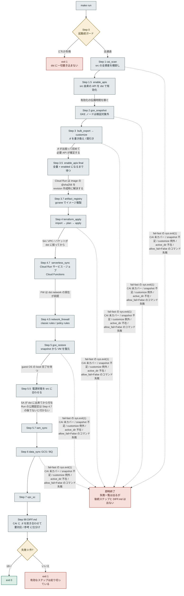
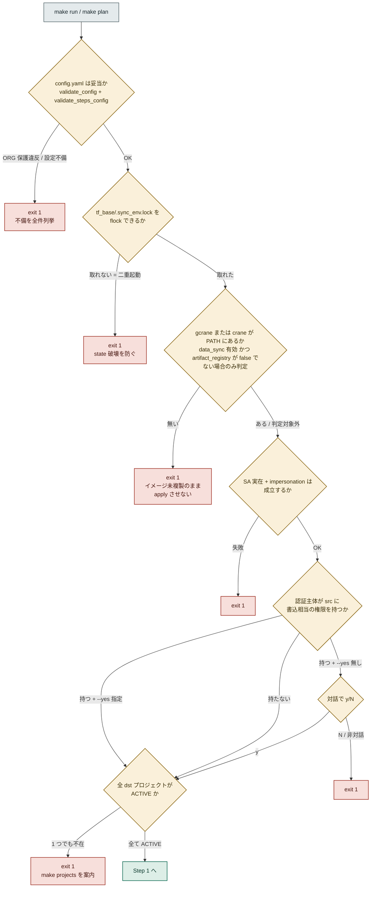
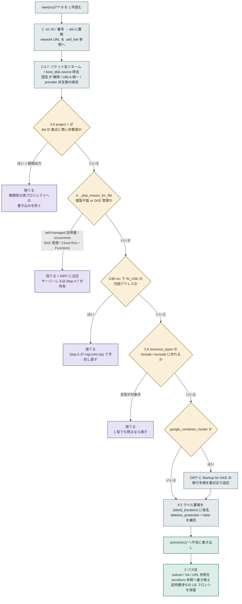
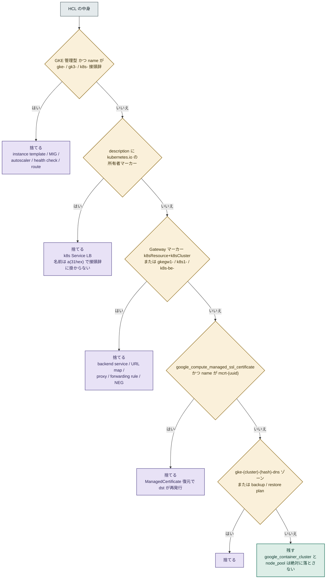
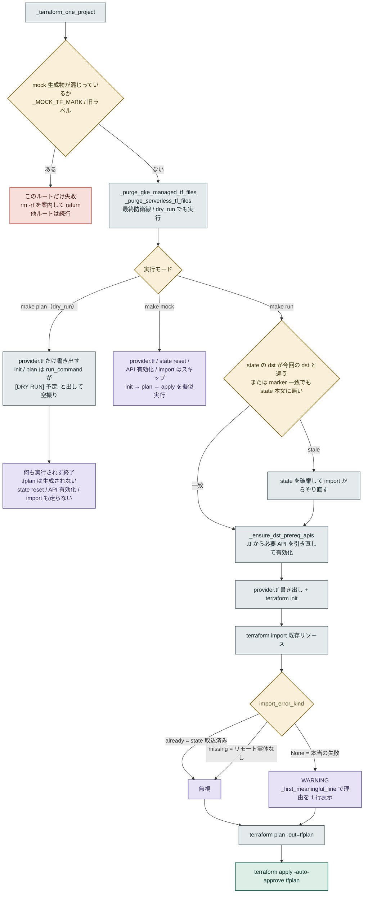
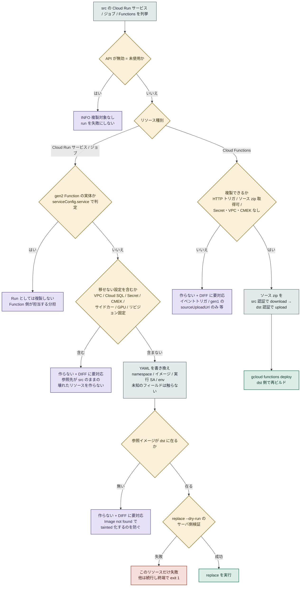
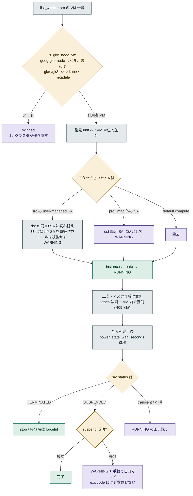

# sync_env 実行フロー

> `scripts/sync_env.py` の実行フロー図。GitHub 上でそのまま図が表示されます。

`make run` は一本道ではなく、**関所の連なり**です。各ステップが「通す / 落とす / 止める」の
どれかを判定し、判定を誤った過去の事故がそのまま今の分岐条件になっています。
ここではその分岐を具体的な条件で描きます。

| 記号 | 意味 |
|---|---|
| 判定（菱形・琥珀） | 条件分岐 |
| 通す（翠） | コピー先に書き込む |
| 落とす（菫） | 複製しない・警告のみ |
| 止める（朱） | `exit 1` |

---

## Step 0 → 99 — 全体の骨格

矢印のラベルは**順序の制約そのもの**です。番号が 1.5 / 3.5 / 3.7 と半端なのは、
「この位置でないと落ちる」と分かって後から挿入されたためです。

*図 1 — ステップの順序は依存関係で決まっている。半端な番号 = 後から割り込ませた位置。*

> **「記録して進む」は並列ワーカーの中だけの話です。** `_parallel_for_each` の worker は
> 失敗しても `sys.exit(1)` せず `stats.add_failure()` に記録し、`main()` が終端で exit 1 に
> します。一方、ステップ本体には今も即 `sys.exit(1)` する箇所があります
> （`step_cai_scan` の未カバー / `step_gce_snapshot` の snapshot 不足 / `customize_hcl` の例外 /
> `step_terraform_apply` の active_dir 不在 / `allow_fail=True` を付けていない `run_command`）。
>
> ただし**失敗一覧そのものは必ず出ます** — `execute()` は `finally: self._print_summary()` で
> 締めるため、中断してもサマリーと失敗詳細はログ末尾に残ります。失われるのは
> **未実行のステップと Step 99 の DIFF.md** だけです。
>
> なお図の各ステップは `step_enabled()` による opt-in で、既定 true は
> `network_firewall` / `iam_sync` / `enable_apis` / `serverless_sync` の 4 つだけです。Step 99 はさらに
> **`cai_scan` と `bulk_export` の両方が有効**なときしか走りません。
> つまり **DIFF.md が無いことは異常終了の証拠になりません**。

---

## Step 0 — 起動前ガード（書き込む前に止める）

ここを抜けたあとの失敗は「30 分走ってから全滅」になります。だから 5 つとも
**コピー先に触る前**に置いてあります（`make mock` では下 3 つが早期 return するため機能しません）。

*図 2 — 5 つの関所はすべて「コピー先に 1 バイトも書く前」。承認プロンプトはコピー先の実在チェックより先に出る。*

> **承認は必ず起動コマンドに現れる形で。** コピー元への書込権限がある場合の続行は
> `--yes` をコマンドラインで明示したときだけです。環境変数による自動承認は
> 「export したまま忘れる」事故を生むため採用していません。

---

## Step 3 — customize（`.tf` 1 ファイルごとの判定チェーン）

`raw/` の 1 ファイルが `active/` に届くまでに通る関門。上から順に評価し、
**どれかに当たった時点で捨てる**（後続の判定はしない）。

*図 3 — 判定順には意味がある。範囲外の除外（3.9）は GKE 移行手順の追記より前に置く。*

---

## Step 3 + 4 — GKE 除外の二段構え

同じ純粋関数 `gke_managed_tf_skip_reason()` を Step 3 と Step 4 の**両方**から呼びます。
customize 側だけに置くと `skip_on_run: true` が customize ごとスキップし、
古い `active/` をそのまま apply して同じ 404 が再発しました。

> **Cloud Run / Cloud Functions も同じ二段構えです。** こちらは 404 対策ではなく
> **二重所有の防止**で、`serverless_tf_skip_reason()` を customize と
> `_purge_serverless_tf_files` の両方から呼びます。Step 4.7 と Terraform が
> 同じリソースを持つと、実行のたびに互いの設定を巻き戻すためです。

*図 4 — `gke_managed_tf_skip_reason()` の判定順。マーカー優先、接頭辞は保険。*

> **`pvc-(uuid)` のディスクはこの関数では落ちません。** 除外しているのは
> `_skip_reason_for_file` の `google_compute_disk` 判定で、これは Step 5（`gce_restore`）が
> 管理する前提の無条件 skip です。次の 2 点に注意してください。
>
> - **`google_compute_region_disk` は除外対象外**です。regional PD の PV
>   （`pvc-(uuid)`）はコピー先に複製され、Backup for GKE の volume restore が作る
>   ディスクと衝突するか孤児になります。
> - **Step 5 は既定で無効**（`_STEP_ENABLED_DEFAULTS` に含まれない）です。config で
>   `gce_restore` を有効にしていない場合、ディスクは `.tf` から落とされたまま
>   誰も作らず、run は成功として終わります。

> **判定を誤ったときの損害が非対称です。** 落とし損ねると宙ぶらりんの参照で apply が 404、
> 落とし過ぎると利用者リソースのコピー漏れ。後者のほうが気付きにくいので、
> 迷ったら**コピーする側**に倒します。ノード VM の判定（`is_gke_node_vm`）が
> 「`goog-gke-node` ラベル」を第一判定にし、名前接頭辞を metadata との AND に
> しているのはこのためです。

---

## Step 4 — `terraform apply` の内部

Terraform ルート（`active/<src>/`）ごとに並列。state は分離済みです。

*図 5 — `make plan` は Terraform を一切実行しない。実行されるのは purge と `provider.tf` の書き出しだけ。*

> **`make plan` は tfplan を作りません。** `run_command` は dry_run のとき
> `side != "src"` のコマンドをすべて `[DRY RUN] 予定:` とログに出して実行せず返します。
> `terraform init` も `terraform plan -out=tfplan` も `side="local"` なので走らず、
> **`make run` は毎回ゼロから plan を計算し直します**。
> 実行ログの「→ tfplan を生成しました」は誤解を招く出力で、実体はありません。
>
> したがって `make plan` が通っても、既存リソースの import 可否・stale state の破棄・
> コピー先の API 有効化は検証されていません。`make run` で初めて 403 や 409 が出ることがあります
> （ただし有効 API の一覧取得だけは dry_run でも走るため、有効化対象の API 名は `make plan` でも表示されます）。

---

## Step 4.7 — サーバーレス複製（Terraform を使わない理由と、作らない判断）

`bulk-export` は **Cloud Run を 1 件も出力しません**。gcloud の asset type → KRM Kind 変換表に
`run.googleapis.com/Service` が無く、`export_resource_types` を渡す経路では
CAI のリストを作る時点で落ちるためです。そこで Terraform ではなく、
**それぞれのサービス自身の仕組み**で複製します。

Cloud Run の `replace` は「**送った spec が正**」＝ YAML から落ちたフィールドは
コピー先で既定値に戻る破壊的 API です。だからこのステップは
「移せないものは中途半端に作らない」方針に倒しています。

*図 6 — 「作らない」判断が 3 箇所ある。いずれも DIFF.md に手順つきで出る。*

> **中途半端に作らないのは、気付けなくなるからです。** 参照先が src を指したまま
> コピー先にリソースを作ると、CAI とコピー先の差分には現れません
> （**存在はしている**ため）。実行時に初めて壊れていることが分かります。
> 一方「作らなかった」ものは DIFF.md の要対応に必ず出ます。
> だから迷ったら**作らない**側に倒します — GKE の除外判定（迷ったらコピーする）とは
> **逆向き**である点に注意してください。GKE は「落とし過ぎ = コピー漏れ」が損害でしたが、
> ここは「作り過ぎ = 気付けない故障」が損害だからです。

> **Cloud Run ジョブはテンプレートが 1 段深い。** サービスは
> `spec.template.spec`（RevisionSpec）ですが、ジョブは Execution を挟むため
> `spec.template.spec.template.spec`（TaskSpec）です。書き換えをパス決め打ちにすると
> **ジョブだけ素通りして src 参照のまま複製**されるため、`containers` を持つ dict を
> 走査する実装にしてあります。

> **Cloud Functions は HTTP トリガのみ対応です。** イベントトリガは参照先の
> トピック名やバケット名が `rename_rules` でコピー先では変わるうえ、Eventarc の
> チャネル設定も要るため、機械的に写すと**誤ったイベント源を購読する関数**に
> なりかねません。第 1 世代でソース zip が `sourceUploadUrl`（署名付きアップロード URL）
> しか無い場合も、gcloud にダウンロード手段が無いため複製できません。

---

## Step 5 / 5.5 — VM 復元と電源状態

復元中は**必ず RUNNING で残し**、全 VM が揃ってから電源状態を合わせます。
boot 途中の VM を suspend すると ACPI に応答できず失敗するためです。

*図 7 — GKE ノードの除外は `list_worker` の 1 箇所だけ。復元と電源処理の両方に効く。*

---

## 失敗の扱い — 何が run を止めるか

扱いは大きく **止める / 記録して進む / 黙って落とす** に分かれます。走り出したあとは
**記録して進む**のが原則ですが、**実行中でも即座に止まる箇所があります**（下表の「実行中でも止める」）。
そこで止まっても失敗一覧は `finally` で必ず出力され、失われるのは未実行のステップと DIFF.md です。

| 事象 | 扱い | 実装 | 結果 |
|---|---|---|---|
| config.yaml の不備 / ORG 保護違反 | 止める | `validate_steps_config` | 全件列挙して即 exit 1 |
| 同じ作業ディレクトリで多重起動 | 止める | `_acquire_run_lock` | state 破壊を防ぐ |
| gcrane / crane が無い | 止める | `check_prerequisites` | `data_sync` 有効 かつ `artifact_registry.enabled != false` のときだけ判定。`make plan` でも止まる |
| コピー先プロジェクトが未作成 | 止める | `check_dst_projects_exist` | 30 分後の全滅を先回りする |
| mock 生成の `.tf` が残存 | そのルートのみ失敗 | `_terraform_one_project` | 他ルートは続行し、終端で exit 1 |
| API 有効化に失敗 | soft fail | `_soft_run` | WARNING + 手動コマンド案内。ただし `_soft_run` 自体は src 書込ガードと mock の未知コマンド検出で `sys.exit(1)` する |
| コピー元で AR / Cloud Run / Functions 未使用（API 無効の 403） | soft fail | `is_api_disabled_error` | INFO「複製対象なし」に落とす |
| サーバーレスが移せない設定を含む | 作らない + 要対応 | `run_service_unsupported_reasons` / `function_unsupported_reasons` | 壊れたリソースを作らない。DIFF に手順を出す |
| `replace --dry-run` の検証に失敗 | そのリソースのみ失敗 | `_sync_one_run_resource` | 他は続行し、終端で exit 1 |
| suspend が ACPI に失敗 | 警告のみ | `_try_dst_suspend` | exit code に影響させない |
| secure tag が未マッピング | skip + 警告 | `fw_policy_rule_flags` | FW を意図せず緩めない |
| コピー先で setIamPolicy 権限が無い | skip + 案内 | `_dst_can_set_iam_policy` | failed に積まない |
| import 失敗（already / missing） | 無視 | `import_error_kind` | 想定内。apply が作る |
| import 失敗（その他） | 警告のみ | `_first_meaningful_line` | 理由を 1 行で表示して続行 |
| コマンド失敗（`allow_fail=True` 未指定） | 実行中でも止める | `run_command` | 未実行のステップと DIFF.md は生成されない |
| CAI 未カバー / snapshot 不足 / customize の例外 | 実行中でも止める | `step_cai_scan` / `step_gce_snapshot` / `customize_hcl` | 同上 |
| active_dir 不在・対象 `.tf` なし（Step 4） | 実行中でも止める | `step_terraform_apply` | **dry_run / mock では停止せず**「✓ Step 4 完了」と表示して return する |

---

## ツールが運ばないもの

これらは不具合ではなく設計です。すべて `DIFF.md` に手順つきで出ます。

| 対象 | 理由 | 誰がやるか |
|---|---|---|
| GKE ノード VM の実体 | 構成のみ複製する方針。台数もマシンタイプもコピー元のまま引き継ぐ | コピー先クラスタが自分で作る |
| PV データ / k8s オブジェクト | クラスタ内は bulk-export の対象外 | Backup for GKE の restore、または再デプロイ |
| コピー元側の backup-plans 作成 | コピー元は read-only。ツールから実行しない | 利用者（コマンドは DIFF に掲載） |
| クロスプロジェクト restore | restore plan は別プロジェクトの backup plan を直接参照できない | backup-channels / restore-channels を作る |
| self-managed SSL 証明書 | 秘密鍵は API から export 不能 | 鍵を持つ利用者がコピー先で作成 |
| Secret Manager の値 | 秘密情報を自動で写さない方針 | 利用者 |
| イベントトリガの Cloud Functions | 参照先のトピック / バケット名がコピー先で変わる。誤ったイベント源を購読させない | 利用者（手順は DIFF に掲載） |
| 第 1 世代 Functions のうちソース取得不能なもの | `sourceUploadUrl` のみで gcloud にダウンロード手段が無い | 利用者（コンソールから zip を取得） |
| Filestore のデータ | Backup for GKE の volume backup は PD のみ | 利用者 |

---

出典: `scripts/sync_env.py` / `CLAUDE.md`
